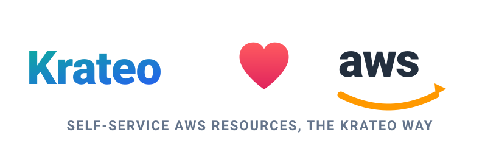

# Krateo AWS Blueprints

<p align="center">
  <picture>
    <source media="(prefers-color-scheme: dark)" srcset="docs/hero-dark.svg">
    
  </picture>
</p>

A catalog of [Krateo](https://krateo.io) blueprints that expose **AWS resources** as
self-service Krateo Compositions, backed by the
[AWS Controllers for Kubernetes (ACK)](https://aws-controllers-k8s.github.io/community/).

Each blueprint is a Helm chart whose templates render a **native ACK custom resource**
(e.g. `s3.services.k8s.aws/v1alpha1` `Bucket`). When you create a Composition, Krateo
renders the chart, the ACK custom resource lands in the cluster, and the ACK service
controller provisions the real AWS resource and reports status back.

> **No KOG / oasgen here.** ACK controllers already are Kubernetes controllers that ship
> their own CRDs and reconcilers, so Krateo consumes them **directly** via
> `CompositionDefinition`s. The Krateo Operator Generator (RestDefinition) pattern is only
> for wrapping raw REST APIs — it is intentionally *not* used in this repo.

## How a blueprint works

```
CompositionDefinition (core.krateo.io)         ← registers the blueprint, pulls the chart
        │
        ▼  publishes a Composition type, e.g. composition.krateo.io/v0-1-0 Bucket
User creates a Composition  ── Krateo renders the chart ──▶  ACK custom resource
                                                                    │
                                                              ACK controller
                                                                    │
                                                                    ▼
                                                              real AWS resource
```

The Composition `spec` **mirrors the ACK custom-resource `spec`** one-to-one (curated to the
fields worth exposing), plus a small set of Krateo-wiring fields such as `region`. Krateo's
`core-provider` builds the Composition CRD **only** from each chart's `values.schema.json`
(it never reads `values.yaml`), so the schema is the contract that drives the portal form.

## Repository layout

```
blueprints/<service>/<resource>/     one blueprint per ACK resource Kind
  chart/
    Chart.yaml                       name: aws-<service>-<resource>
    values.yaml
    values.schema.json               curated projection of the ACK CRD spec — drives the CRD + form
    templates/<kind>.yaml            renders the ACK custom resource
  compositiondefinition.yaml         registers the blueprint with Krateo
  customform.yaml                    portal card + form
  README.md
tools/ackgen/                        Go generator that emits blueprints from ACK CRD schemas (Phase 2)
docs/                                authentication + controller-install prerequisites
```

## Prerequisites

These blueprints provision AWS resources; they do **not** install the ACK controllers and do
**not** configure AWS credentials. Both are cluster-admin prerequisites, set up once:

1. **Install the ACK service controller** for the resource you want (e.g. the S3 controller
   before using `aws-s3-bucket`). See [`docs/installing-controllers.md`](docs/installing-controllers.md).
2. **Configure AWS authentication** for that controller — IRSA / EKS Pod Identity (default,
   recommended) or static credentials. See [`docs/authentication.md`](docs/authentication.md).
3. Krateo `core-provider` installed in the cluster.

## Catalog

**242 blueprints across 68 AWS services**, covering the ACK resource CRDs. The full table
(service → resource → chart → ACK/Composition Kind → API group) is in
**[`CATALOG.md`](CATALOG.md)**.

Every blueprint under `blueprints/<service>/<resource>/` is generated by
[`tools/ackgen`](tools/ackgen) from the upstream ACK CRD and is validated with `helm template`
(which enforces `values.schema.json`). The `aws-s3-bucket` blueprint is the reference the
generator was built and validated against.

To (re)generate a blueprint from an ACK CRD:

```sh
go run ./tools/ackgen \
  -crd https://raw.githubusercontent.com/aws-controllers-k8s/s3-controller/main/config/crd/bases/s3.services.k8s.aws_buckets.yaml \
  -out blueprints -lint
```

## Charts

Every chart is published to GHCR as an OCI Helm artifact on a semver tag:

```
oci://ghcr.io/braghettos/charts/aws-<service>-<resource>:<version>
```
