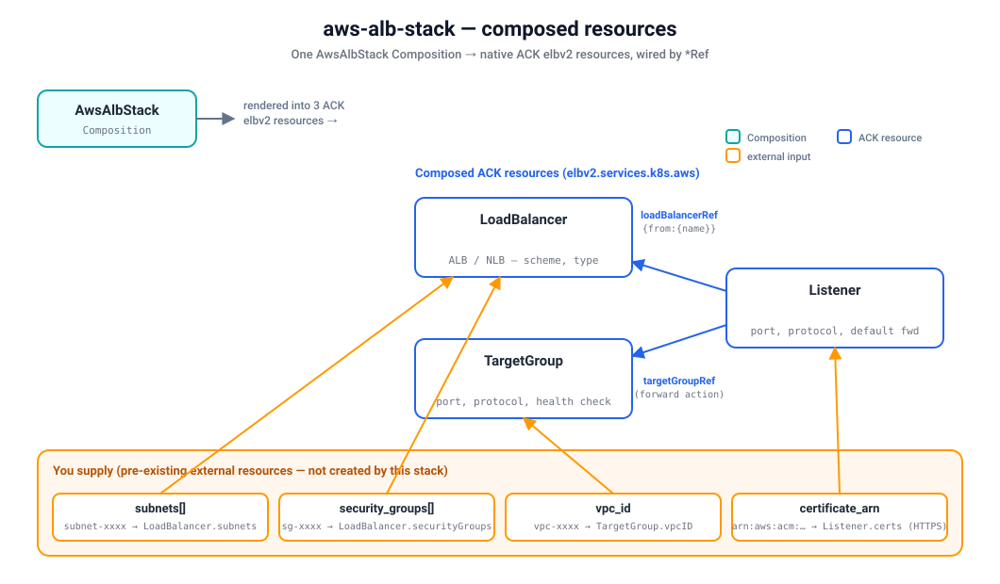

# Quickstart — provision a real Application Load Balancer on kind

Install the `aws-alb-stack` blueprint on a local [kind](https://kind.sigs.k8s.io/) cluster and
provision a **real AWS Application Load Balancer** end-to-end through Krateo. This composite stack
mirrors the [`terraform-aws-modules/alb/aws`](https://registry.terraform.io/modules/terraform-aws-modules/alb/aws)
module: a `CompositionDefinition` publishes the `AwsAlbStack` type, you create one `AwsAlbStack`
Composition, and Krateo renders it into native ACK **elbv2** resources — one `LoadBalancer`, one
`TargetGroup`, and one `Listener` — which the ACK controller reconciles into the real ALB,
target group, and listener on AWS.



Verified with: kind `v0.24`, Helm `v3.19`, `core-provider 1.0.0`, ACK
`elbv2-controller` (`oci://public.ecr.aws/aws-controllers-k8s/elbv2-chart`), `aws-alb-stack 0.3.0`.

## Prerequisites

- `kind`, `kubectl`, `helm`, and the `aws` CLI installed.
- An AWS account and credentials for the ACK controller. The simplest setup is a dedicated IAM
  user; the controller's IAM principal needs `elasticloadbalancing:*` (plus `ec2:Describe*` to
  resolve subnets/security groups). See
  [`../../../docs/authentication.md`](../../../docs/authentication.md) for IRSA / Pod Identity and
  least-privilege alternatives, and
  [`../../../docs/installing-controllers.md`](../../../docs/installing-controllers.md) for the
  controller install pattern.
- **Pre-existing external resources you must supply as Composition inputs.** This stack provisions
  the load balancer, target group, and listener — it does **not** create the network it attaches
  to. Create these beforehand (e.g. with the `aws-vpc-stack` blueprint) and have their IDs ready:
  - **VPC ID** — `vpc_id` → ACK `TargetGroup.spec.vpcID`.
  - **Subnet IDs** (≥ 2, in different AZs) — `subnets` → ACK `LoadBalancer.spec.subnets`.
  - **Security group ID(s)** (for `application` LBs) — `security_groups` →
    ACK `LoadBalancer.spec.securityGroups`.
  - **ACM certificate ARN** (only for HTTPS/TLS listeners) — per-listener `certificate_arn` →
    ACK `Listener.spec.certificates[].certificateARN`.

> This quickstart uses the static-credential path (a Kubernetes Secret) because it works on any
> cluster. On EKS, prefer IRSA / Pod Identity and skip the Secret.

## 1. Create a kind cluster

(Skip this if you already have a cluster — just point `kubectl` at it.)

```sh
kind create cluster --name ack-e2e --wait 90s
```

## 2. Install the ACK elbv2 controller

First store your IAM user's key in a local profile (do this in your own terminal so the secret
never lands in logs):

```sh
aws configure set aws_access_key_id     <ACCESS_KEY_ID>     --profile krateo-ack
aws configure set aws_secret_access_key <SECRET_ACCESS_KEY> --profile krateo-ack
aws configure set region                eu-central-1        --profile krateo-ack
aws --profile krateo-ack sts get-caller-identity     # confirms the user
```

Create the `ack-system` namespace and a Secret holding an AWS shared-credentials file (the ACK
controller chart expects a `credentials` key). The command substitution keeps the secret out of
your shell history:

```sh
kubectl create namespace ack-system

kubectl create secret generic aws-credentials -n ack-system \
  --from-literal=credentials="$(printf '[default]\naws_access_key_id = %s\naws_secret_access_key = %s\n' \
      "$(aws --profile krateo-ack configure get aws_access_key_id)" \
      "$(aws --profile krateo-ack configure get aws_secret_access_key)")"
```

Install the ACK elbv2 controller from its public ECR OCI chart:

```sh
helm install ack-elbv2-controller \
  oci://public.ecr.aws/aws-controllers-k8s/elbv2-chart \
  --namespace ack-system \
  --set aws.region=eu-central-1 \
  --set aws.credentials.secretName=aws-credentials \
  --set aws.credentials.secretKey=credentials \
  --set aws.credentials.profile=default \
  --wait

kubectl get pods -n ack-system            # ack-elbv2-controller ... 1/1 Running
kubectl get crd loadbalancers.elbv2.services.k8s.aws \
                targetgroups.elbv2.services.k8s.aws \
                listeners.elbv2.services.k8s.aws
```

> To pin a version, resolve it first:
> `helm show chart oci://public.ecr.aws/aws-controllers-k8s/elbv2-chart | awk '/^version:/{print $2}'`
> and pass `--version <that>`.

## 3. Install Krateo core-provider

`core-provider` reconciles `CompositionDefinition`s into CRDs and renders Compositions (it bundles
chart-inspector and deploys the composition-dynamic-controller).

```sh
helm repo add krateo https://charts.krateo.io && helm repo update krateo
helm install core-provider krateo/core-provider --version 1.0.0 \
  -n krateo-system --create-namespace --wait

kubectl get pods -n krateo-system         # core-provider + chart-inspector Running
```

## 4. Register the blueprint

This publishes the `AwsAlbStack` Composition type (`composition.krateo.io/v0-3-0`, plural
`awsalbstacks`) from the public GHCR OCI artifact `oci://ghcr.io/krateo-blueprints/charts/aws-alb-stack`.
From `blueprints/_stacks/alb/`:

```sh
kubectl create namespace aws-alb-system
kubectl apply -f compositiondefinition.yaml   # publishes the AwsAlbStack type
kubectl apply -f customform.yaml              # optional: portal card + form

kubectl wait compositiondefinition/aws-alb-stack -n aws-alb-system \
  --for=condition=Ready --timeout=300s
```

This starts a dedicated `awsalbstacks-v0-3-0-controller`.

## 5. Create a Composition

The spec below mirrors `chart/values.yaml` — a public `application` ALB with one HTTP target group
and one HTTP listener. **Replace the placeholder IDs** (`vpc-xxxx`, `subnet-xxxx`, `sg-xxxx`) with
your real pre-existing resources from the Prerequisites:

```sh
kubectl apply -f - <<'EOF'
apiVersion: composition.krateo.io/v0-3-0
kind: AwsAlbStack
metadata:
  name: my-alb
  namespace: aws-alb-system
spec:
  region: eu-central-1
  name: krateo-alb
  load_balancer_type: application
  internal: false

  # Pre-existing external resources — replace with your real IDs:
  vpc_id: "vpc-xxxx"
  subnets:
    - "subnet-xxxx"
    - "subnet-yyyy"
  security_groups:
    - "sg-xxxx"

  enable_deletion_protection: false
  enable_http2: true
  idle_timeout: 60
  default_port: 80
  default_protocol: HTTP

  target_groups:
    http:
      name: krateo-alb-http
      port: 80
      protocol: HTTP
      target_type: instance
      health_check:
        enabled: true
        path: "/"
        protocol: HTTP
        healthy_threshold: 3
        unhealthy_threshold: 3
        interval: 30
        timeout: 6
        matcher: "200"

  listeners:
    http:
      port: 80
      protocol: HTTP
      forward:
        target_group_key: http

  tags:
    team: platform
EOF

kubectl wait awsalbstack/my-alb -n aws-alb-system --for=condition=Ready --timeout=300s
```

## 6. Verify

```sh
# Krateo Composition is Ready, and it rendered the three wired ACK resources:
kubectl get awsalbstacks -n aws-alb-system
kubectl get loadbalancers.elbv2.services.k8s.aws \
            targetgroups.elbv2.services.k8s.aws \
            listeners.elbv2.services.k8s.aws -n aws-alb-system

# The ACK LoadBalancer reconciled successfully against AWS:
kubectl get loadbalancers.elbv2.services.k8s.aws -n aws-alb-system \
  -o jsonpath='{.items[0].status.conditions[?(@.type=="ACK.ResourceSynced")].status}{"\n"}'
# -> True

# The real ALB exists in AWS, with its listener attached:
aws --profile krateo-ack elbv2 describe-load-balancers --names krateo-alb
aws --profile krateo-ack elbv2 describe-target-groups  --names krateo-alb-http
```

The resources come up in strict dependency order — `LoadBalancer` + `TargetGroup` first, then the
`Listener` (it stays in *Resolving refs* until both its `loadBalancerRef` and `targetGroupRef`
targets are `Synced`).

## 7. Clean up

Deleting the Composition cascades through ACK and removes the **real** load balancer, target group,
and listener (set `enable_deletion_protection: false`, as above, or the delete is blocked by AWS):

```sh
kubectl delete awsalbstack my-alb -n aws-alb-system
kubectl wait --for=delete loadbalancers.elbv2.services.k8s.aws -n aws-alb-system --all --timeout=300s

kind delete cluster --name ack-e2e
```

## Limitations / required inputs

- The VPC, subnets, security groups, and (for HTTPS) ACM certificate are **inputs**, not outputs —
  this stack does not create them. Provision them first (the `aws-vpc-stack` blueprint covers the
  network) and pass their IDs/ARNs via `vpc_id`, `subnets`, `security_groups`, and
  per-listener `certificate_arn`.
- This stack mirrors the Terraform module's **core inputs**, not all 60+. Security-group creation,
  Route53 records, WAF association, access/connection logging, listener rules, and
  weighted/redirect/fixed-response actions are not composed here.
- Each listener's default action is a single-target-group `forward`. If a listener omits
  `forward.target_group_key`, the first declared target group is used.
