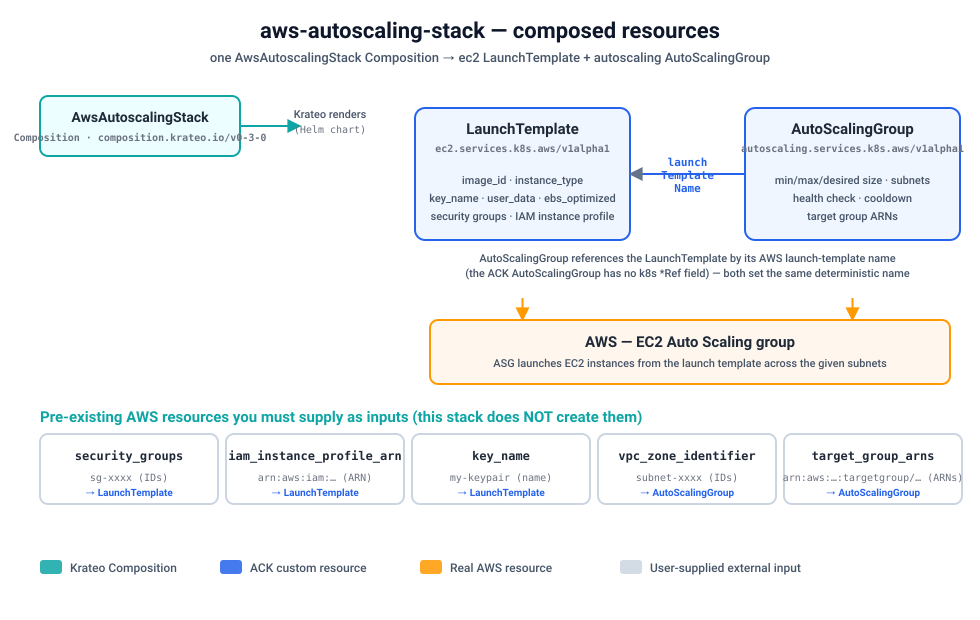

# Quickstart — provision a real EC2 Auto Scaling group on kind

Install the `aws-autoscaling-stack` blueprint on a local [kind](https://kind.sigs.k8s.io/)
cluster and provision a **real AWS EC2 Auto Scaling group** end-to-end through Krateo. A
`CompositionDefinition` publishes the `AwsAutoscalingStack` type, you create one
`AwsAutoscalingStack` Composition, and Krateo renders it into two wired native ACK resources — an
ec2 **LaunchTemplate** and an autoscaling **AutoScalingGroup** — which the ACK controllers
reconcile against AWS. The Composition mirrors the
[`terraform-aws-modules/autoscaling/aws`](https://registry.terraform.io/modules/terraform-aws-modules/autoscaling/aws)
module (a curated core subset of its inputs).



Verified with: kind `v0.24`, Helm `v3.19`, `core-provider 1.0.0`, ACK `ec2-chart` +
`autoscaling-chart`, `aws-autoscaling-stack 0.3.0`.

## Prerequisites

- An AWS account and credentials. The controllers' IAM principal needs **EC2 launch-template**
  and **Auto Scaling** permissions (e.g. `AmazonEC2FullAccess` +
  `AutoScalingFullAccess` for a quick demo; scope down for production). See
  [`../../../docs/authentication.md`](../../../docs/authentication.md) for IRSA / Pod Identity /
  static-credential options, and
  [`../../../docs/installing-controllers.md`](../../../docs/installing-controllers.md) for the
  controller install pattern.
- `kind`, `kubectl`, `helm`, and the `aws` CLI installed.
- **Two ACK controllers** — this stack composes resources from two AWS services, so you must
  install **both** the ACK ec2 and the ACK autoscaling controllers (steps below).

> This quickstart uses the static-credential path (a Kubernetes Secret) because it works on any
> cluster. On EKS, prefer IRSA / Pod Identity and skip the Secret.

### Pre-existing AWS resources you must supply

This stack **does not create** the upstream networking/IAM resources — it passes them through by
ID/ARN/name. Have these ready before you create the Composition (only `vpc_zone_identifier` is
required to launch instances in a VPC; the rest are optional):

- **`vpc_zone_identifier`** — one or more **subnet IDs** (`subnet-…`) the ASG launches instances
  in. Create them with the `aws-vpc-stack` blueprint, or reuse an existing VPC's subnets.
- **`security_groups`** — **security group IDs** (`sg-…`) attached to the launch template
  (optional).
- **`iam_instance_profile_arn`** — ARN of an existing **IAM instance profile** for the instances
  (optional).
- **`key_name`** — name of an existing **EC2 key pair** for SSH (optional).
- **`target_group_arns`** — ARNs of existing **ELB/ALB/NLB target groups** to register instances
  with (optional).

## 1. Create a kind cluster

(Skip if you already have a cluster — just point `kubectl` at it.)

```sh
kind create cluster --name ack-e2e --wait 90s
```

## 2. Configure AWS credentials and install the ACK controllers

Store your IAM user's key in a local profile (do this in your own terminal so the secret never
lands in logs):

```sh
aws configure set aws_access_key_id     <ACCESS_KEY_ID>     --profile krateo-ack
aws configure set aws_secret_access_key <SECRET_ACCESS_KEY> --profile krateo-ack
aws configure set region                eu-central-1        --profile krateo-ack
aws --profile krateo-ack sts get-caller-identity     # confirms the user
```

Create the `ack-system` namespace and a Secret holding an AWS shared-credentials file (the ACK
controller charts expect a `credentials` key). The command substitution keeps the secret out of
your shell history:

```sh
kubectl create namespace ack-system

kubectl create secret generic aws-credentials -n ack-system \
  --from-literal=credentials="$(printf '[default]\naws_access_key_id = %s\naws_secret_access_key = %s\n' \
      "$(aws --profile krateo-ack configure get aws_access_key_id)" \
      "$(aws --profile krateo-ack configure get aws_secret_access_key)")"
```

Install **both** controllers into `ack-system`, pointing each at that Secret:

```sh
# ACK ec2 controller (LaunchTemplate)
helm install ack-ec2-controller \
  oci://public.ecr.aws/aws-controllers-k8s/ec2-chart \
  --namespace ack-system \
  --set aws.region=eu-central-1 \
  --set aws.credentials.secretName=aws-credentials \
  --set aws.credentials.secretKey=credentials \
  --set aws.credentials.profile=default \
  --wait

# ACK autoscaling controller (AutoScalingGroup)
helm install ack-autoscaling-controller \
  oci://public.ecr.aws/aws-controllers-k8s/autoscaling-chart \
  --namespace ack-system \
  --set aws.region=eu-central-1 \
  --set aws.credentials.secretName=aws-credentials \
  --set aws.credentials.secretKey=credentials \
  --set aws.credentials.profile=default \
  --wait

kubectl get pods -n ack-system        # both controllers ... 1/1 Running
kubectl get crd launchtemplates.ec2.services.k8s.aws autoscalinggroups.autoscaling.services.k8s.aws
```

> Pin chart versions with `--version` for reproducible installs. Resolve the latest with
> `helm show chart oci://public.ecr.aws/aws-controllers-k8s/<svc>-chart`. Exact `--set` value keys
> can vary between chart versions — confirm with `helm show values …` (see
> [`../../../docs/authentication.md`](../../../docs/authentication.md)).

## 3. Install Krateo core-provider

`core-provider` reconciles `CompositionDefinition`s into CRDs and renders Compositions (it
bundles chart-inspector and deploys the composition-dynamic-controller).

```sh
helm repo add krateo https://charts.krateo.io && helm repo update krateo
helm install core-provider krateo/core-provider --version 1.0.0 \
  -n krateo-system --create-namespace --wait

kubectl get pods -n krateo-system         # core-provider + chart-inspector Running
```

## 4. Register the blueprint

Create the namespace and apply the `CompositionDefinition`, which publishes the
`AwsAutoscalingStack` type and pulls the chart from the public GHCR OCI artifact (no credentials
needed):

```sh
kubectl create namespace aws-autoscaling-system

kubectl apply -f - <<'EOF'
apiVersion: core.krateo.io/v1alpha1
kind: CompositionDefinition
metadata:
  name: aws-autoscaling-stack
  namespace: aws-autoscaling-system
spec:
  chart:
    url: oci://ghcr.io/krateo-blueprints/charts/aws-autoscaling-stack
    version: "0.3.0"
EOF

kubectl wait compositiondefinition/aws-autoscaling-stack -n aws-autoscaling-system \
  --for=condition=Ready --timeout=300s
```

This publishes an `AwsAutoscalingStack` Composition type (`composition.krateo.io/v0-3-0`, plural
`awsautoscalingstacks`) and starts a dedicated `awsautoscalingstacks-v0-3-0-controller`.

If you committed the rendered manifests locally, you can equivalently
`kubectl apply -f compositiondefinition.yaml` (and the optional `kubectl apply -f customform.yaml`
for the Krateo portal card + form).

## 5. Create a Composition

Fill the **external IDs/ARNs with your real values** — the placeholders below are clearly fake.
At minimum, replace `vpc_zone_identifier` with subnet IDs from a VPC in `eu-central-1`, and use a
valid `image_id` (AMI) for that region:

```sh
kubectl apply -f - <<'EOF'
apiVersion: composition.krateo.io/v0-3-0
kind: AwsAutoscalingStack
metadata:
  name: my-asg
  namespace: aws-autoscaling-system
spec:
  region: eu-central-1
  name: krateo-asg
  min_size: 1
  max_size: 3
  desired_capacity: 2
  image_id: "ami-0123456789abcdef0"      # replace with a real AMI in eu-central-1
  instance_type: "t3.micro"
  vpc_zone_identifier:                    # replace with real subnet IDs (existing subnets)
    - "subnet-xxxxxxxxxxxxxxxxx"
    - "subnet-yyyyyyyyyyyyyyyyy"
  health_check_type: "EC2"
  health_check_grace_period: 300
  default_cooldown: 300
  capacity_rebalance: false
  ebs_optimized: false
  # --- optional pre-existing resources (leave empty/omit if unused) ---
  # key_name: "my-keypair"                       # existing EC2 key pair
  # security_groups: ["sg-xxxxxxxxxxxxxxxxx"]    # existing security group IDs
  # iam_instance_profile_arn: "arn:aws:iam::123456789012:instance-profile/my-profile"
  # target_group_arns: ["arn:aws:elasticloadbalancing:eu-central-1:123456789012:targetgroup/my-tg/abc123"]
  launch_template_version: "$Latest"
  tags:
    team: platform
    purpose: ack-e2e
EOF

kubectl wait awsautoscalingstack/my-asg -n aws-autoscaling-system \
  --for=condition=Ready --timeout=300s
```

## 6. Verify

```sh
# Krateo Composition is Ready, and Krateo rendered the two ACK resources:
kubectl get awsautoscalingstacks -n aws-autoscaling-system
kubectl get launchtemplates.ec2.services.k8s.aws -n aws-autoscaling-system
kubectl get autoscalinggroups.autoscaling.services.k8s.aws -n aws-autoscaling-system

# Each ACK resource reconciled successfully against AWS (ACK.ResourceSynced=True):
kubectl get launchtemplates.ec2.services.k8s.aws -n aws-autoscaling-system \
  -o jsonpath='{.items[0].status.conditions[?(@.type=="ACK.ResourceSynced")].status}{"\n"}'
kubectl get autoscalinggroups.autoscaling.services.k8s.aws -n aws-autoscaling-system \
  -o jsonpath='{.items[0].status.conditions[?(@.type=="ACK.ResourceSynced")].status}{"\n"}'
# -> True (each)

# The real resources exist in AWS:
aws --profile krateo-ack ec2 describe-launch-templates \
  --filters Name=launch-template-name,Values=krateo-asg
aws --profile krateo-ack autoscaling describe-auto-scaling-groups \
  --auto-scaling-group-names krateo-asg
```

The EC2 console (Auto Scaling groups) shows `krateo-asg` with the launch template, desired
capacity 2, and the instances spread across the subnets you supplied.

## 7. Clean up

Deleting the Composition cascades through ACK and tears down the **real** AutoScalingGroup
(terminating its instances) and the launch template:

```sh
kubectl delete awsautoscalingstack my-asg -n aws-autoscaling-system
kubectl wait --for=delete autoscalinggroups.autoscaling.services.k8s.aws \
  -n aws-autoscaling-system --all --timeout=300s
kubectl wait --for=delete launchtemplates.ec2.services.k8s.aws \
  -n aws-autoscaling-system --all --timeout=180s

kind delete cluster --name ack-e2e
```

## Limitations / required inputs

- **External resources are passed through, not created.** `vpc_zone_identifier` (subnet IDs),
  `security_groups` (SG IDs), `target_group_arns` (target group ARNs), `iam_instance_profile_arn`
  (IAM instance profile ARN) and `key_name` (EC2 key pair) all reference **existing** AWS
  resources you must supply. Provision the VPC/subnets with the `aws-vpc-stack` blueprint and
  create IAM/SG/target-group resources separately.
- This stack composes the **launch template + auto scaling group** core of the module and a
  curated subset of its inputs (not all 100+). Scaling policies, scheduled actions, lifecycle
  hooks, CloudWatch alarms, IAM-instance-profile creation, mixed-instances policy and instance
  refresh are **not** composed here.
- The ACK `AutoScalingGroup` references the launch template by AWS **name** (not a k8s `*Ref`), so
  both resources share the deterministic launch-template name set by the stack — the ASG resolves
  the template once it is `Synced`.
