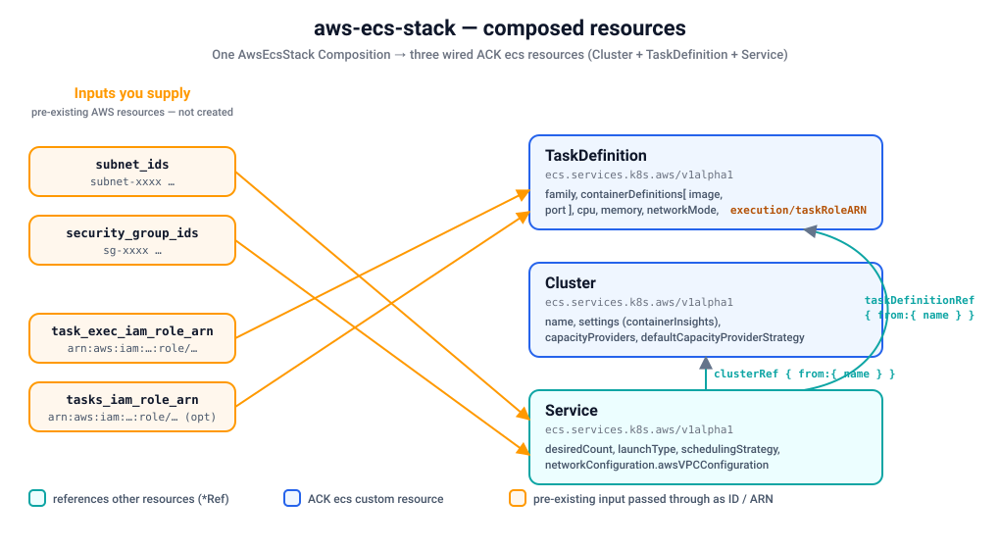

# Quickstart — provision a real ECS service on kind

Install the `aws-ecs-stack` blueprint on a local [kind](https://kind.sigs.k8s.io/) cluster and
provision a **real Amazon ECS workload** end-to-end through Krateo: a `CompositionDefinition`
publishes the `AwsEcsStack` type, you create one `AwsEcsStack` Composition, and Krateo renders it
into three wired ACK `ecs` resources — a **Cluster**, a **TaskDefinition**, and a **Service** —
which the ACK `ecs` controller reconciles against AWS. This mirrors the
[`terraform-aws-modules/ecs/aws`](https://registry.terraform.io/modules/terraform-aws-modules/ecs/aws)
module (a curated core subset, flattened for a single Fargate service).



Verified with: kind `v0.24`, Helm `v3.19`, `core-provider 1.0.0`, ACK `ecs-chart` (latest), and
`aws-ecs-stack 0.3.0`. Result — the Composition reaches `Ready=True`, and the ACK `Cluster`,
`TaskDefinition` and `Service` each reach `ACK.ResourceSynced=True` with the cluster, task
definition and running service visible in the ECS console.

## Prerequisites

- An AWS account and credentials with ECS permissions. The simplest setup: a dedicated IAM user
  with ECS cluster/task-definition/service permissions plus `iam:PassRole` for the task roles (see
  [`../../../docs/authentication.md`](../../../docs/authentication.md) for IRSA and least-privilege
  alternatives). You'll need its access key id + secret.
- `kind`, `kubectl`, `helm`, and the `aws` CLI installed.
- **Pre-existing AWS resources this stack does NOT create** — you must supply them as inputs on the
  Composition spec:
  - **Subnet IDs** (`subnet_ids`) — at least one existing subnet ID (`subnet-…`) the Fargate task
    ENIs attach to. Required when `network_mode: awsvpc`.
  - **Security group IDs** (`security_group_ids`) — at least one existing SG ID (`sg-…`) for the
    task ENIs.
  - **Task execution role ARN** (`task_exec_iam_role_arn`) — an existing IAM role ARN (e.g.
    `ecsTaskExecutionRole`) used to pull the image / write logs. Optional but recommended.
  - **Task role ARN** (`tasks_iam_role_arn`) — an existing IAM role ARN for the task's own AWS
    permissions. Optional.

  You can create a VPC/subnets/security-groups out of band — for example with the sibling
  [`aws-vpc-stack`](../vpc/quickstart.md) blueprint — and create the IAM roles with the AWS CLI or
  console.

> This quickstart uses the static-credential path (a Kubernetes Secret) because it works on any
> cluster. On EKS, prefer IRSA / Pod Identity and skip the Secret.

## 1. Create a kind cluster

Skip this if you already have a cluster; just point `kubectl` at it.

```sh
kind create cluster --name ack-e2e --wait 90s
```

## 2. Configure AWS credentials and install the ACK ecs controller

Store your IAM user's key in a local profile (do this in your own terminal so the secret never
lands in logs):

```sh
aws configure set aws_access_key_id     <ACCESS_KEY_ID>     --profile krateo-ack
aws configure set aws_secret_access_key <SECRET_ACCESS_KEY> --profile krateo-ack
aws configure set region                eu-central-1        --profile krateo-ack
aws --profile krateo-ack sts get-caller-identity     # confirms the user
```

Create the `ack-system` namespace and a Secret holding an AWS shared-credentials file (the ACK
controller chart expects a `credentials` key). The command substitution keeps the secret out of
your shell history:

```sh
kubectl create namespace ack-system

kubectl create secret generic aws-credentials -n ack-system \
  --from-literal=credentials="$(printf '[default]\naws_access_key_id = %s\naws_secret_access_key = %s\n' \
      "$(aws --profile krateo-ack configure get aws_access_key_id)" \
      "$(aws --profile krateo-ack configure get aws_secret_access_key)")"
```

Install the ACK **ecs** controller chart (`oci://public.ecr.aws/aws-controllers-k8s/ecs-chart`).
This blueprint targets `ecs.services.k8s.aws/v1alpha1`, so the controller must be installed before
you create any Composition (see [`../../../docs/installing-controllers.md`](../../../docs/installing-controllers.md)):

```sh
# Resolve the latest ecs-chart version (or pin one explicitly)
export CHART_VERSION=$(
  helm show chart oci://public.ecr.aws/aws-controllers-k8s/ecs-chart 2>/dev/null \
    | awk '/^version:/{print $2}'
)

helm install ack-ecs-controller \
  oci://public.ecr.aws/aws-controllers-k8s/ecs-chart --version "${CHART_VERSION}" \
  --namespace ack-system \
  --set aws.region=eu-central-1 \
  --set aws.credentials.secretName=aws-credentials \
  --set aws.credentials.secretKey=credentials \
  --set aws.credentials.profile=default \
  --wait

kubectl get pods -n ack-system            # ack-ecs-controller ... 1/1 Running
kubectl get crd clusters.ecs.services.k8s.aws taskdefinitions.ecs.services.k8s.aws services.ecs.services.k8s.aws
```

## 3. Install Krateo core-provider

`core-provider` reconciles `CompositionDefinition`s into CRDs and renders Compositions (it
bundles chart-inspector and deploys the composition-dynamic-controller).

```sh
helm repo add krateo https://charts.krateo.io && helm repo update krateo
helm install core-provider krateo/core-provider --version 1.0.0 \
  -n krateo-system --create-namespace --wait

kubectl get pods -n krateo-system         # core-provider + chart-inspector Running
```

## 4. Register the blueprint

Create the stack namespace and apply the `CompositionDefinition`, which pulls the chart straight
from the public GHCR OCI artifact `oci://ghcr.io/krateo-blueprints/charts/aws-ecs-stack:0.3.0` (no
credentials needed):

```sh
kubectl create namespace aws-ecs-system
kubectl apply -f compositiondefinition.yaml   # publishes the AwsEcsStack type
kubectl apply -f customform.yaml              # optional: portal card + form

kubectl wait compositiondefinition/aws-ecs-stack -n aws-ecs-system \
  --for=condition=Ready --timeout=300s
```

This publishes an `AwsEcsStack` Composition type (`composition.krateo.io/v0-3-0`, plural
`awsecsstacks`) and starts a dedicated `awsecsstacks-v0-3-0-controller`.

## 5. Create a Composition

Fill the external IDs/ARNs with **your real** subnet IDs, security group IDs and role ARNs — the
placeholders below (`subnet-xxxx`, `sg-xxxx`, `111122223333`) are clearly fake and will not
reconcile. With `network_mode: awsvpc` you must supply at least one subnet (and usually a security
group), otherwise the Service cannot bring up task ENIs.

```sh
kubectl apply -f - <<'EOF'
apiVersion: composition.krateo.io/v0-3-0
kind: AwsEcsStack
metadata:
  name: my-ecs
  namespace: aws-ecs-system
spec:
  region: eu-central-1

  # Cluster
  cluster_name: krateo-ecs
  cluster_setting:
    - name: containerInsights
      value: enabled
  default_capacity_provider_strategy:
    FARGATE:
      base: 1
      weight: 100
  cluster_capacity_providers:
    - FARGATE
    - FARGATE_SPOT

  # Task definition
  family: krateo-app
  container_name: app
  image: public.ecr.aws/nginx/nginx:latest
  container_port: 80
  cpu: "256"
  memory: "512"
  network_mode: awsvpc
  requires_compatibilities:
    - FARGATE
  # Existing IAM role ARNs (NOT created by this stack) — replace with yours:
  task_exec_iam_role_arn: "arn:aws:iam::111122223333:role/ecsTaskExecutionRole"
  tasks_iam_role_arn: ""

  # Service
  desired_count: 1
  launch_type: FARGATE
  scheduling_strategy: REPLICA
  assign_public_ip: true
  enable_execute_command: false
  enable_ecs_managed_tags: false
  # Existing subnet / security group IDs (NOT created by this stack) — replace with yours:
  subnet_ids:
    - subnet-xxxxxxxxxxxxxxxxx
  security_group_ids:
    - sg-xxxxxxxxxxxxxxxxx

  tags:
    team: platform
    purpose: ack-e2e
EOF

kubectl wait awsecsstack/my-ecs -n aws-ecs-system --for=condition=Ready --timeout=300s
```

## 6. Verify

```sh
# Krateo Composition is Ready, and Krateo rendered three ACK ecs CRs:
kubectl get awsecsstacks -n aws-ecs-system
kubectl get clusters.ecs.services.k8s.aws -n aws-ecs-system
kubectl get taskdefinitions.ecs.services.k8s.aws -n aws-ecs-system
kubectl get services.ecs.services.k8s.aws -n aws-ecs-system

# Each ACK resource reconciled successfully against AWS (ACK.ResourceSynced=True).
# The Service stays in "Resolving refs" until the Cluster and TaskDefinition it
# references (clusterRef / taskDefinitionRef) are themselves Synced:
kubectl get clusters.ecs.services.k8s.aws -n aws-ecs-system \
  -o jsonpath='{.items[0].status.conditions[?(@.type=="ACK.ResourceSynced")].status}{"\n"}'   # -> True
kubectl get services.ecs.services.k8s.aws -n aws-ecs-system \
  -o jsonpath='{.items[0].status.conditions[?(@.type=="ACK.ResourceSynced")].status}{"\n"}'   # -> True

# The real workload exists in AWS:
aws --profile krateo-ack ecs list-clusters
aws --profile krateo-ack ecs list-services --cluster krateo-ecs
aws --profile krateo-ack ecs describe-services --cluster krateo-ecs --services krateo-ecs-service
```

The ECS console shows the same — the `krateo-ecs` cluster with Container Insights enabled, the
`krateo-app` task definition, and the `krateo-ecs-service` service running `desired_count` task(s).

## 7. Clean up

Deleting the Composition cascades through ACK and removes the **real** AWS resources (Service →
TaskDefinition → Cluster):

```sh
kubectl delete awsecsstack my-ecs -n aws-ecs-system
kubectl wait --for=delete services.ecs.services.k8s.aws -n aws-ecs-system --all --timeout=300s
kubectl wait --for=delete clusters.ecs.services.k8s.aws -n aws-ecs-system --all --timeout=300s
aws --profile krateo-ack ecs list-clusters    # krateo-ecs no longer listed

kind delete cluster --name ack-e2e
```

## Limitations / required inputs

- This stack mirrors the module's **core** inputs for a **single service**, not all 60+ top-level
  inputs nor the full nested `services` map (auto-scaling, multiple services, load balancers,
  service connect, EBS volume configuration, etc. are out of scope).
- It does **not** create supporting resources. You must supply these **pre-existing** external
  resources as inputs; they are passed through to ACK as IDs/ARNs:
  - `subnet_ids` → `Service.networkConfiguration.awsVPCConfiguration.subnets`
  - `security_group_ids` → `Service.networkConfiguration.awsVPCConfiguration.securityGroups`
  - `task_exec_iam_role_arn` → `TaskDefinition.executionRoleARN`
  - `tasks_iam_role_arn` → `TaskDefinition.taskRoleARN`
- `network_mode: awsvpc` requires `subnet_ids` (and usually `security_group_ids`); the
  `networkConfiguration` block is only rendered when at least one of them is set.
