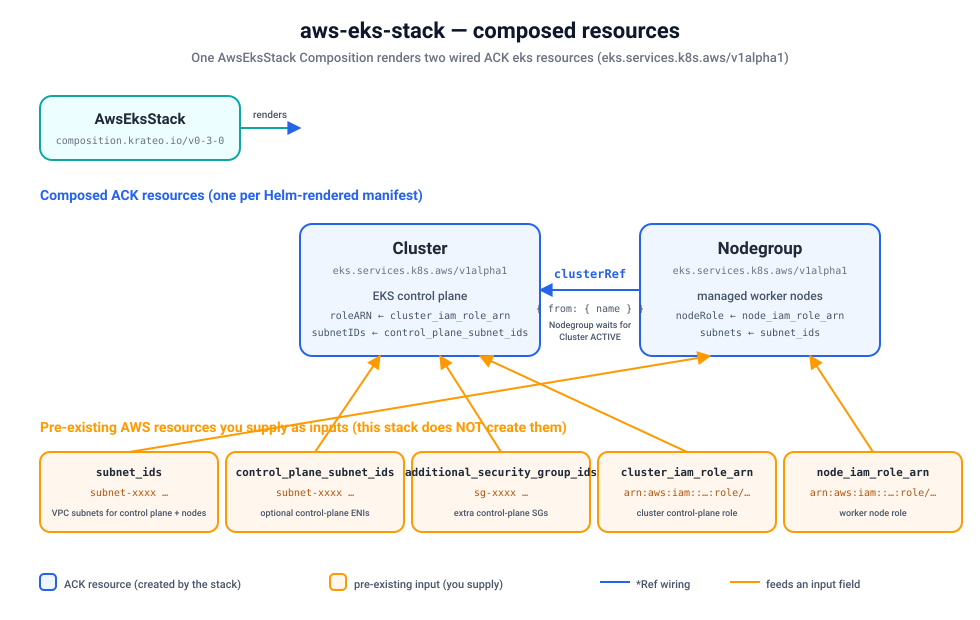

# Quickstart — provision a real EKS cluster + node group on kind

Install the `aws-eks-stack` blueprint on a local [kind](https://kind.sigs.k8s.io/) cluster and
provision a **real Amazon EKS cluster with one managed node group** end-to-end through Krateo,
mirroring the [`terraform-aws-modules/eks/aws`](https://registry.terraform.io/modules/terraform-aws-modules/eks/aws)
module. A `CompositionDefinition` publishes the `AwsEksStack` type, you create one `AwsEksStack`
Composition, and the chain `Krateo → ACK Cluster + Nodegroup CRs → ACK eks controller → AWS`
materializes the cluster and node group (in dependency order: **Cluster → Nodegroup**).



Verified with: kind `v0.24`, Helm `v3.19`, `core-provider 1.0.0`, ACK
`eks-chart` (`oci://public.ecr.aws/aws-controllers-k8s/eks-chart`), `aws-eks-stack 0.3.0`.

## Prerequisites

- `kind`, `kubectl`, `helm`, and the `aws` CLI installed.
- An AWS account and credentials for the ACK controller — see
  [`../../../docs/authentication.md`](../../../docs/authentication.md) (IRSA / Pod Identity, or
  static credentials for non-EKS clusters like kind). The controller's IAM principal needs EKS
  cluster + node group permissions **plus `iam:PassRole`** for the two role ARNs you supply below.
- Krateo `core-provider` (installed in step 3).
- **Pre-existing AWS resources you must supply as Composition inputs** (this stack does *not*
  create them — see the orange boxes in the diagram and [Limitations](#limitations--required-inputs)):
  - **VPC subnet IDs** (`subnet_ids`) — at least two subnets in different AZs for the nodes/node
    group, and (if `control_plane_subnet_ids` is empty) the control-plane ENIs. Provision them
    first with the companion `aws-vpc-stack` or an existing VPC.
  - *(optional)* **control-plane subnet IDs** (`control_plane_subnet_ids`) — subnets for the
    control-plane ENIs only.
  - *(optional)* **additional security group IDs** (`additional_security_group_ids`) for the
    control plane.
  - **Cluster IAM role ARN** (`cluster_iam_role_arn`) — a role with the EKS cluster trust policy
    and `AmazonEKSClusterPolicy` attached.
  - **Node IAM role ARN** (`node_iam_role_arn`) — a role with the EC2 trust policy and
    `AmazonEKSWorkerNodePolicy`, `AmazonEKS_CNI_Policy`, `AmazonEC2ContainerRegistryReadOnly`.

## 1. Create a kind cluster

This is the *management* cluster that runs Krateo and the ACK controller; the EKS cluster it
provisions lives in AWS. Skip this step if you already have a cluster to use.

```sh
kind create cluster --name ack-e2e --wait 90s
```

## 2. Install the ACK eks controller

The stack renders `Cluster` and `Nodegroup` custom resources but does not install the controller
that reconciles them. Install the ACK **eks** controller (see
[`../../../docs/installing-controllers.md`](../../../docs/installing-controllers.md) for the full
pattern and [`../../../docs/authentication.md`](../../../docs/authentication.md) for credentials).

The example below uses the static-credential path so it works on kind; on EKS prefer IRSA / Pod
Identity and drop the `aws.credentials.*` flags.

```sh
export AWS_REGION=eu-central-1
export CHART_VERSION=$(
  helm show chart oci://public.ecr.aws/aws-controllers-k8s/eks-chart 2>/dev/null \
    | awk '/^version:/{print $2}'
)

# Static credentials (kind/demo). On EKS, skip this and use IRSA/Pod Identity instead.
kubectl create namespace ack-system
kubectl create secret generic aws-credentials -n ack-system \
  --from-literal=credentials="$(printf '[default]\naws_access_key_id = %s\naws_secret_access_key = %s\n' \
      "$(aws configure get aws_access_key_id)" \
      "$(aws configure get aws_secret_access_key)")"

helm install ack-eks-controller \
  oci://public.ecr.aws/aws-controllers-k8s/eks-chart --version "${CHART_VERSION}" \
  --namespace ack-system \
  --set aws.region="${AWS_REGION}" \
  --set aws.credentials.secretName=aws-credentials \
  --set aws.credentials.secretKey=credentials \
  --set aws.credentials.profile=default \
  --wait

kubectl get pods -n ack-system                          # ack-eks-controller ... 1/1 Running
kubectl get crd clusters.eks.services.k8s.aws nodegroups.eks.services.k8s.aws
```

## 3. Install Krateo core-provider

`core-provider` reconciles `CompositionDefinition`s into CRDs and renders Compositions (it
bundles chart-inspector and deploys the composition-dynamic-controller).

```sh
helm repo add krateo https://charts.krateo.io && helm repo update krateo
helm install core-provider krateo/core-provider --version 1.0.0 \
  -n krateo-system --create-namespace --wait

kubectl get pods -n krateo-system                       # core-provider + chart-inspector Running
```

## 4. Register the blueprint

The `CompositionDefinition` pulls the chart straight from the public GHCR OCI artifact
`oci://ghcr.io/krateo-blueprints/charts/aws-eks-stack:0.3.0` (no credentials needed). Apply the
`compositiondefinition.yaml` shipped in this directory, and optionally `customform.yaml` (the
portal card + form):

```sh
kubectl create namespace aws-eks-system
kubectl apply -f compositiondefinition.yaml             # publishes the AwsEksStack type
kubectl apply -f customform.yaml                        # optional: portal card + form

kubectl wait compositiondefinition/aws-eks-stack -n aws-eks-system \
  --for=condition=Ready --timeout=300s
```

This publishes an `AwsEksStack` Composition type (`composition.krateo.io/v0-3-0`, plural
`awseksstacks`) and starts a dedicated `awseksstacks-v0-3-0-controller`.

## 5. Create the Composition

Replace the placeholder subnet IDs and IAM role ARNs below with the **real** pre-existing
resources from the prerequisites (`subnet-xxxx` / `arn:aws:iam::…` are deliberately fake):

```sh
kubectl apply -f - <<'EOF'
apiVersion: composition.krateo.io/v0-3-0
kind: AwsEksStack
metadata:
  name: my-eks
  namespace: aws-eks-system
spec:
  region: eu-central-1
  name: krateo-eks
  kubernetes_version: "1.33"
  authentication_mode: API_AND_CONFIG_MAP
  endpoint_public_access: true
  endpoint_private_access: true
  cluster_endpoint_public_access_cidrs:
    - "0.0.0.0/0"
  # Pre-existing VPC subnets (replace with your real subnet IDs):
  subnet_ids:
    - subnet-0aaaaaaaaaaaaaaa1
    - subnet-0aaaaaaaaaaaaaaa2
  control_plane_subnet_ids: []
  additional_security_group_ids: []
  ip_family: ipv4
  enabled_log_types:
    - api
    - audit
    - authenticator
  # Pre-existing IAM role ARNs (replace with your real role ARNs):
  cluster_iam_role_arn: arn:aws:iam::111122223333:role/krateo-eks-cluster-role
  node_iam_role_arn: arn:aws:iam::111122223333:role/krateo-eks-node-role
  node_group_name: default
  node_ami_type: AL2023_x86_64_STANDARD
  node_capacity_type: ON_DEMAND
  node_instance_types: ["m5.large"]
  node_disk_size: 20
  node_desired_size: 2
  node_min_size: 1
  node_max_size: 3
  tags:
    team: platform
EOF
```

Krateo renders the Composition into one `Cluster` and one `Nodegroup` ACK custom resource. The
`Nodegroup` references the `Cluster` via `clusterRef`, so it stays in *Resolving refs* until the
control plane is `ACTIVE` — expect the cluster to take ~10–15 minutes, then the node group a few
more. Watch progress with:

```sh
kubectl wait awseksstack/my-eks -n aws-eks-system --for=condition=Ready --timeout=1800s
```

## 6. Verify

```sh
# Krateo Composition is Ready, and Krateo applied the two ACK CRs:
kubectl get awseksstacks -n aws-eks-system
kubectl get clusters.eks.services.k8s.aws,nodegroups.eks.services.k8s.aws -n aws-eks-system

# Each ACK resource reconciled successfully against AWS:
kubectl get clusters.eks.services.k8s.aws -n aws-eks-system \
  -o jsonpath='{.items[0].status.conditions[?(@.type=="ACK.ResourceSynced")].status}{"\n"}'
# -> True
kubectl get nodegroups.eks.services.k8s.aws -n aws-eks-system \
  -o jsonpath='{.items[0].status.conditions[?(@.type=="ACK.ResourceSynced")].status}{"\n"}'
# -> True

# The real cluster + node group exist in AWS:
aws eks describe-cluster   --name krateo-eks --region eu-central-1 \
  --query 'cluster.status'                                    # -> ACTIVE
aws eks describe-nodegroup --cluster-name krateo-eks \
  --nodegroup-name default --region eu-central-1 \
  --query 'nodegroup.status'                                  # -> ACTIVE
```

## 7. Clean up

Deleting the Composition cascades through ACK and removes the **real** node group and cluster (in
reverse dependency order — the node group is torn down before the control plane):

```sh
kubectl delete awseksstack my-eks -n aws-eks-system
kubectl wait --for=delete nodegroups.eks.services.k8s.aws -n aws-eks-system --all --timeout=900s
kubectl wait --for=delete clusters.eks.services.k8s.aws    -n aws-eks-system --all --timeout=900s

aws eks describe-cluster --name krateo-eks --region eu-central-1   # -> ResourceNotFoundException

kind delete cluster --name ack-e2e
```

The pre-existing subnets and IAM roles are **not** deleted — this stack never owned them.

## Limitations / required inputs

This stack mirrors the module's **core** inputs and composes exactly two ACK resources (one
`Cluster` + one managed `Nodegroup`). Crucially, you must supply these **pre-existing** resources
as Composition inputs:

- **VPC / subnets** — pass subnet IDs via `subnet_ids` (and optionally `control_plane_subnet_ids`,
  `additional_security_group_ids`). The stack does **not** create a VPC; use `aws-vpc-stack` or an
  existing VPC first.
- **IAM roles** — pass `cluster_iam_role_arn` (cluster control-plane role) and `node_iam_role_arn`
  (worker node role). The stack does **not** create IAM roles or the IRSA/OIDC provider.
- **One node group only**, and no EKS managed add-ons (CoreDNS, kube-proxy, VPC-CNI), access
  entries, Fargate profiles, or self-managed node groups. See the repo's single-resource
  `blueprints/eks/*` charts for those.

See [`README.md`](README.md) and [`chart/values.schema.json`](chart/values.schema.json) for the
full input reference.
