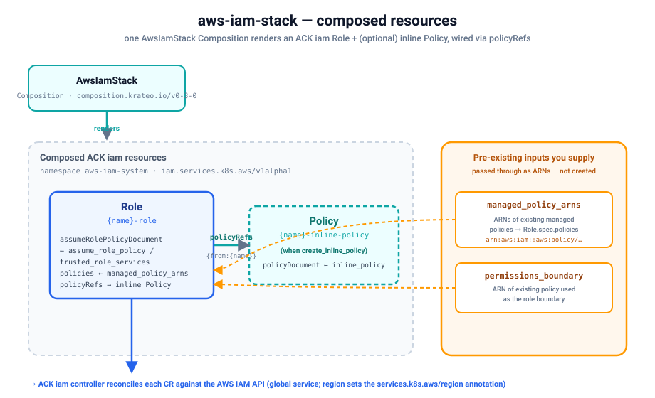

# Quickstart — provision a real IAM role on kind

Install the `aws-iam-stack` blueprint on a local [kind](https://kind.sigs.k8s.io/) cluster and
provision a **real AWS IAM role** (plus an optional customer-managed inline policy) end-to-end
through Krateo. This stack mirrors the
[`terraform-aws-modules/iam/aws`](https://registry.terraform.io/modules/terraform-aws-modules/iam/aws)
module (its `iam-role` / `iam-assumable-role` submodules): a `CompositionDefinition` publishes the
`AwsIamStack` type, you create one `AwsIamStack` Composition, and the chain
`Krateo → ACK Role/Policy CRs → ACK iam controller → AWS` materializes the role.



Verified with: kind `v0.24`, Helm `v3.19`, `core-provider 1.0.0`, ACK `iam-chart` (controller),
`aws-iam-stack 0.3.0`. Result — the Composition reaches `Ready=True`, the ACK `Role` (and inline
`Policy`) reach `ACK.ResourceSynced=True`, and the role appears in the IAM console with the trust
policy, attached managed policy, and tags from the Composition spec.

## Prerequisites

- An AWS account and credentials with **IAM** permissions (create/update/delete roles and
  policies). The simplest setup: a dedicated IAM user with `IAMFullAccess` (see
  [`../../../docs/authentication.md`](../../../docs/authentication.md) for IRSA and
  least-privilege alternatives). You'll need its access key id + secret.
- `kind`, `kubectl`, `helm`, and the `aws` CLI installed.
- **Pre-existing external resources you must supply as inputs** (this stack passes them through as
  ARNs — it does **not** create them):
  - `managed_policy_arns` — ARNs of **existing** AWS-managed or customer-managed policies to
    attach to the role (e.g. `arn:aws:iam::aws:policy/AmazonS3ReadOnlyAccess`). Optional.
  - `permissions_boundary` — ARN of an **existing** policy to use as the role's permissions
    boundary. Optional.

> This quickstart uses the static-credential path (a Kubernetes Secret) because it works on any
> cluster. On EKS, prefer IRSA / Pod Identity and skip the Secret — see
> [`../../../docs/authentication.md`](../../../docs/authentication.md). IAM is a **global**
> service, so the `region` field only sets the `services.k8s.aws/region` annotation the ACK
> controller reads.

## 1. Create a kind cluster

```sh
kind create cluster --name ack-e2e --wait 90s
```

(If you already have a cluster, skip this and target it with your current `kubectl` context.)

## 2. Configure AWS credentials

Store your IAM user's key in a local profile (do this in your own terminal so the secret never
lands in logs):

```sh
aws configure set aws_access_key_id     <ACCESS_KEY_ID>     --profile krateo-ack
aws configure set aws_secret_access_key <SECRET_ACCESS_KEY> --profile krateo-ack
aws configure set region                eu-central-1        --profile krateo-ack
aws --profile krateo-ack sts get-caller-identity     # confirms the user
```

Create the `ack-system` namespace and a Secret holding an AWS shared-credentials file (the ACK
controller chart expects a `credentials` key). The command substitution keeps the secret out of
your shell history:

```sh
kubectl create namespace ack-system

kubectl create secret generic aws-credentials -n ack-system \
  --from-literal=credentials="$(printf '[default]\naws_access_key_id = %s\naws_secret_access_key = %s\n' \
      "$(aws --profile krateo-ack configure get aws_access_key_id)" \
      "$(aws --profile krateo-ack configure get aws_secret_access_key)")"
```

See [`../../../docs/authentication.md`](../../../docs/authentication.md) for details.

## 3. Install the ACK iam controller

This stack needs the ACK **iam** controller
([`oci://public.ecr.aws/aws-controllers-k8s/iam-chart`](https://gallery.ecr.aws/aws-controllers-k8s/iam-chart)).
See [`../../../docs/installing-controllers.md`](../../../docs/installing-controllers.md) for the
general install pattern.

```sh
helm install ack-iam-controller \
  oci://public.ecr.aws/aws-controllers-k8s/iam-chart \
  --namespace ack-system \
  --set aws.region=eu-central-1 \
  --set aws.credentials.secretName=aws-credentials \
  --set aws.credentials.secretKey=credentials \
  --set aws.credentials.profile=default \
  --wait

kubectl get pods -n ack-system                 # ack-iam-controller ... 1/1 Running
kubectl get crd roles.iam.services.k8s.aws policies.iam.services.k8s.aws
```

> IAM is a global service, but the chart still requires an `aws.region`; the controller uses the
> global IAM endpoint regardless.

## 4. Install Krateo core-provider

`core-provider` reconciles `CompositionDefinition`s into CRDs and renders Compositions (it
bundles chart-inspector and deploys the composition-dynamic-controller).

```sh
helm repo add krateo https://charts.krateo.io && helm repo update krateo
helm install core-provider krateo/core-provider --version 1.0.0 \
  -n krateo-system --create-namespace --wait

kubectl get pods -n krateo-system              # core-provider + chart-inspector Running
```

## 5. Register the blueprint

The `CompositionDefinition` pulls the chart straight from the public GHCR OCI artifact
`oci://ghcr.io/krateo-blueprints/charts/aws-iam-stack:0.3.0` (no credentials needed). The repo already
ships [`compositiondefinition.yaml`](compositiondefinition.yaml) and an optional
[`customform.yaml`](customform.yaml) (portal card + form):

```sh
kubectl create namespace aws-iam-system
kubectl apply -f compositiondefinition.yaml    # publishes the AwsIamStack type
kubectl apply -f customform.yaml               # optional: portal card + form

kubectl wait compositiondefinition/aws-iam-stack -n aws-iam-system \
  --for=condition=Ready --timeout=300s
```

This publishes an `AwsIamStack` Composition type (`composition.krateo.io/v0-3-0`, plural
`awsiamstacks`) and starts a dedicated `awsiamstacks-v0-3-0-controller`.

## 6. Create the Composition

The spec uses the **same input names as the Terraform module** (a curated core subset). This
example mirrors `chart/values.yaml`: a role assumable by EC2, with one existing AWS-managed policy
attached and an inline policy created from JSON. Replace the placeholder ARNs with **real**
existing-policy ARNs from your account (the `arn:aws:iam::aws:policy/...` managed policy below is
real and always present; `permissions_boundary` is left out — supply a real ARN if you use it):

```sh
kubectl apply -f - <<'EOF'
apiVersion: composition.krateo.io/v0-3-0
kind: AwsIamStack
metadata:
  name: my-iam-role
  namespace: aws-iam-system
spec:
  region: eu-central-1
  create: true
  name: krateo-iam-role
  path: "/"
  description: "IAM role provisioned by the Krateo aws-iam-stack blueprint"
  max_session_duration: 3600
  trusted_role_services:
    - ec2.amazonaws.com
  managed_policy_arns:
    - "arn:aws:iam::aws:policy/AmazonS3ReadOnlyAccess"
  # permissions_boundary: "arn:aws:iam::123456789012:policy/your-existing-boundary"
  create_inline_policy: true
  inline_policy: |
    {"Version":"2012-10-17","Statement":[{"Effect":"Allow","Action":["s3:GetObject"],"Resource":"*"}]}
  tags:
    managed-by: krateo
EOF

kubectl wait awsiamstack/my-iam-role -n aws-iam-system --for=condition=Ready --timeout=300s
```

## 7. Verify

```sh
# Krateo Composition is Ready, and Krateo applied the ACK Role (+ inline Policy):
kubectl get awsiamstacks -n aws-iam-system
kubectl get roles.iam.services.k8s.aws -n aws-iam-system
kubectl get policies.iam.services.k8s.aws -n aws-iam-system

# The ACK Role reconciled successfully against AWS:
kubectl get roles.iam.services.k8s.aws -n aws-iam-system \
  -o jsonpath='{.items[0].status.conditions[?(@.type=="ACK.ResourceSynced")].status}{"\n"}'
# -> True

# The real role exists in AWS, with the attached managed policy:
aws --profile krateo-ack iam get-role --role-name krateo-iam-role
aws --profile krateo-ack iam list-attached-role-policies --role-name krateo-iam-role
```

The IAM console shows the same role, its trust relationship (`ec2.amazonaws.com`), the attached
`AmazonS3ReadOnlyAccess` managed policy, the customer-managed inline policy, and the
`managed-by=krateo` tag.

## 8. Clean up

Deleting the Composition cascades through ACK and removes the **real** role and inline policy
(the attached AWS-managed policy and any `permissions_boundary` are pre-existing and are **not**
deleted):

```sh
kubectl delete awsiamstack my-iam-role -n aws-iam-system
kubectl wait --for=delete roles.iam.services.k8s.aws -n aws-iam-system --all --timeout=180s
aws --profile krateo-ack iam get-role --role-name krateo-iam-role   # -> NoSuchEntity

kind delete cluster --name ack-e2e
```

## Limitations / required inputs

- Mirrors the module's **core** inputs, not all of them. The OIDC/SAML assume-role helpers,
  condition blocks, instance-profile creation, and group/user submodules are not composed here.
- Inputs that reference **existing external resources** are accepted as-is and passed through to
  ACK as ARNs — they are **not** created by this stack:
  - `managed_policy_arns` — ARNs of pre-existing managed policies (→ `Role.spec.policies`).
  - `permissions_boundary` — ARN of a pre-existing policy used as the boundary.
- IAM is a **global** service; `region` only sets the `services.k8s.aws/region` annotation the ACK
  controller consumes. Empty inherits the controller default.

See the blueprint [`README.md`](README.md) for the full input table and composed-resource wiring.
