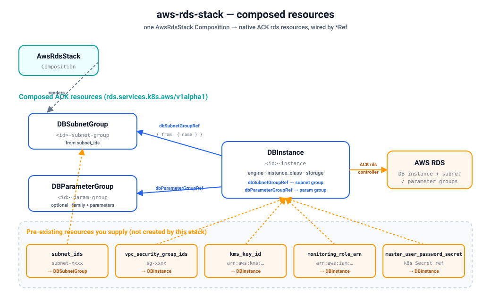

# Quickstart — provision a real RDS database on kind

Install the `aws-rds-stack` blueprint on a local [kind](https://kind.sigs.k8s.io/) cluster and
provision a **real Amazon RDS database** end-to-end through Krateo. This stack mirrors the
[`terraform-aws-modules/rds/aws`](https://registry.terraform.io/modules/terraform-aws-modules/rds/aws)
module: one `AwsRdsStack` Composition renders the native ACK rds resources — a `DBSubnetGroup`, an
optional `DBParameterGroup`, and a `DBInstance` wired to them by `*Ref` — and the chain
`Krateo → ACK rds CRs → ACK rds controller → AWS` materializes the database.



Verified with: kind `v0.24`, Helm `v3.19`, `core-provider 1.0.0`, ACK `rds-chart` (latest from
`oci://public.ecr.aws/aws-controllers-k8s/rds-chart`), `aws-rds-stack 0.3.0`. Result — the
Composition reaches `Ready=True`, the ACK `DBSubnetGroup`/`DBInstance` reach
`ACK.ResourceSynced=True`, and the database appears in the RDS console.

## Prerequisites

- An AWS account and credentials with RDS permissions. The simplest setup: a dedicated IAM user
  with `AmazonRDSFullAccess` (see [`../../../docs/authentication.md`](../../../docs/authentication.md)
  for IRSA and least-privilege alternatives). You'll need its access key id + secret.
- `kind`, `kubectl`, `helm`, and the `aws` CLI installed.
- **Pre-existing external resources** this stack does **not** create — you must supply their IDs/ARNs
  on the Composition spec (derive them from your existing VPC/account):
  - `subnet_ids` — **required in practice** — existing VPC subnet IDs (≥ 2 in different AZs) used to
    build the `DBSubnetGroup`. RDS requires subnets in at least two Availability Zones.
  - `vpc_security_group_ids` — existing security group IDs to associate with the DB instance.
  - `kms_key_id` *(optional)* — KMS key ARN for encryption at rest (omit to use the default RDS key).
  - `monitoring_role_arn` *(optional)* — IAM role ARN for Enhanced Monitoring (only when
    `monitoring_interval > 0`).
  - `master_user_password_secret` *(optional)* — a Kubernetes Secret holding the master password,
    used only when `manage_master_user_password: false`. The default (`true`) lets RDS manage the
    password in AWS Secrets Manager, so no Secret is needed.

> This quickstart uses the static-credential path (a Kubernetes Secret) because it works on any
> cluster. On EKS, prefer IRSA / Pod Identity and skip the Secret.

## 1. Create a kind cluster

Skip this if you already have a cluster — just point `kubectl` at it.

```sh
kind create cluster --name ack-e2e --wait 90s
```

## 2. Configure AWS credentials

Store your IAM user's key in a local profile (do this in your own terminal so the secret never
lands in logs):

```sh
aws configure set aws_access_key_id     <ACCESS_KEY_ID>     --profile krateo-ack
aws configure set aws_secret_access_key <SECRET_ACCESS_KEY> --profile krateo-ack
aws configure set region                eu-central-1        --profile krateo-ack
aws --profile krateo-ack sts get-caller-identity     # confirms the user
```

Create the `ack-system` namespace and a Secret holding an AWS shared-credentials file (the ACK
controller chart expects a `credentials` key). The command substitution keeps the secret out of
your shell history:

```sh
kubectl create namespace ack-system

kubectl create secret generic aws-credentials -n ack-system \
  --from-literal=credentials="$(printf '[default]\naws_access_key_id = %s\naws_secret_access_key = %s\n' \
      "$(aws --profile krateo-ack configure get aws_access_key_id)" \
      "$(aws --profile krateo-ack configure get aws_secret_access_key)")"
```

## 3. Install the ACK rds controller

This stack renders `rds.services.k8s.aws` custom resources, so it needs the ACK **rds** controller
(`oci://public.ecr.aws/aws-controllers-k8s/rds-chart`). See
[`../../../docs/installing-controllers.md`](../../../docs/installing-controllers.md) for the general
pattern.

```sh
helm install ack-rds-controller \
  oci://public.ecr.aws/aws-controllers-k8s/rds-chart \
  --namespace ack-system \
  --set aws.region=eu-central-1 \
  --set aws.credentials.secretName=aws-credentials \
  --set aws.credentials.secretKey=credentials \
  --set aws.credentials.profile=default \
  --wait

kubectl get pods -n ack-system            # ack-rds-controller ... 1/1 Running
kubectl get crd dbinstances.rds.services.k8s.aws dbsubnetgroups.rds.services.k8s.aws
```

> To pin a specific chart version, add `--version <x.y.z>` (resolve the latest with
> `helm show chart oci://public.ecr.aws/aws-controllers-k8s/rds-chart`).

## 4. Install Krateo core-provider

`core-provider` reconciles `CompositionDefinition`s into CRDs and renders Compositions (it
bundles chart-inspector and deploys the composition-dynamic-controller).

```sh
helm repo add krateo https://charts.krateo.io && helm repo update krateo
helm install core-provider krateo/core-provider --version 1.0.0 \
  -n krateo-system --create-namespace --wait

kubectl get pods -n krateo-system         # core-provider + chart-inspector Running
```

## 5. Register the blueprint

The `CompositionDefinition` pulls the chart straight from the public GHCR OCI artifact
`oci://ghcr.io/krateo-blueprints/charts/aws-rds-stack:0.3.0` (no credentials needed). Apply the
bundled `compositiondefinition.yaml` (and, optionally, `customform.yaml` for the Krateo portal
card + form):

```sh
kubectl create namespace aws-rds-system
kubectl apply -f compositiondefinition.yaml   # publishes the AwsRdsStack type
kubectl apply -f customform.yaml              # optional: portal card + form

kubectl wait compositiondefinition/aws-rds-stack -n aws-rds-system \
  --for=condition=Ready --timeout=300s
```

This publishes an `AwsRdsStack` Composition type (`composition.krateo.io/v0-3-0`, plural
`awsrdsstacks`) and starts a dedicated `awsrdsstacks-v0-3-0-controller`.

## 6. Create the Composition

The spec uses the same input names as the Terraform module (see `chart/values.yaml`). Replace the
placeholder `subnet-xxxx` / `sg-xxxx` values with **real** IDs from your VPC — RDS needs subnets in
at least two AZs:

```sh
kubectl apply -f - <<'EOF'
apiVersion: composition.krateo.io/v0-3-0
kind: AwsRdsStack
metadata:
  name: my-rds
  namespace: aws-rds-system
spec:
  region: eu-central-1
  identifier: krateo-rds
  engine: postgres
  engine_version: "16.4"
  instance_class: db.t3.micro
  allocated_storage: 20
  storage_type: gp3
  storage_encrypted: true
  db_name: appdb
  username: krateoadmin
  # Let RDS manage the master password in Secrets Manager (no Kubernetes Secret needed):
  manage_master_user_password: true
  port: "5432"
  multi_az: false
  publicly_accessible: false
  # Existing subnet / security-group IDs — replace with real ones from your VPC:
  subnet_ids: ["subnet-xxxx", "subnet-yyyy"]
  vpc_security_group_ids: ["sg-xxxx"]
  backup_retention_period: 7
  copy_tags_to_snapshot: true
  deletion_protection: false
  create_db_subnet_group: true
  db_subnet_group_description: "Subnet group for krateo-rds"
  create_db_parameter_group: false
  tags:
    team: platform
EOF

kubectl wait awsrdsstack/my-rds -n aws-rds-system --for=condition=Ready --timeout=300s
```

> RDS provisioning takes several minutes. The Composition turns `Ready` once Krateo has applied
> the ACK resources; the `DBInstance` itself becomes `ACK.ResourceSynced=True` once AWS finishes
> creating the database.

## 7. Verify

```sh
# Krateo Composition is Ready, and Krateo applied the composed ACK CRs:
kubectl get awsrdsstacks -n aws-rds-system

kubectl get dbsubnetgroups.rds.services.k8s.aws,dbinstances.rds.services.k8s.aws \
  -n aws-rds-system

# The ACK DBInstance reconciled successfully against AWS:
kubectl get dbinstances.rds.services.k8s.aws -n aws-rds-system \
  -o jsonpath='{.items[0].status.conditions[?(@.type=="ACK.ResourceSynced")].status}{"\n"}'
# -> True

# The real database exists in AWS:
aws --profile krateo-ack rds describe-db-instances \
  --db-instance-identifier krateo-rds \
  --query 'DBInstances[0].{Status:DBInstanceStatus,Engine:Engine,Endpoint:Endpoint.Address}'
```

If you created a parameter group (`create_db_parameter_group: true`), also list it:

```sh
kubectl get dbparametergroups.rds.services.k8s.aws -n aws-rds-system
```

## 8. Clean up

Deleting the Composition cascades through ACK and removes the **real** RDS resources. Make sure
`deletion_protection` is `false` first (it is in the example above):

```sh
kubectl delete awsrdsstack my-rds -n aws-rds-system
kubectl wait --for=delete dbinstances.rds.services.k8s.aws -n aws-rds-system --all --timeout=600s
aws --profile krateo-ack rds describe-db-instances \
  --db-instance-identifier krateo-rds 2>&1 | grep -q DBInstanceNotFound && echo "deleted"

kind delete cluster --name ack-e2e
```

## Limitations / required inputs

- This stack provisions only the RDS resources (subnet group, instance, optional parameter group).
  Inputs that reference **existing external resources** are passed through by ID/ARN and are
  **not** created here:
  - `subnet_ids` — existing VPC subnet IDs (≥ 2 AZs) used to build the DB subnet group.
  - `vpc_security_group_ids` — existing security group IDs.
  - `kms_key_id`, `monitoring_role_arn` — existing KMS key / IAM role ARNs.
  - `master_user_password_secret` — an existing Kubernetes Secret (only when
    `manage_master_user_password: false`).
- Mirrors the module's **core** inputs, not all 100+ (full schema in
  [`chart/values.schema.json`](chart/values.schema.json)). Set `create_db_subnet_group: false`
  with `db_subnet_group_name` (and/or `create_db_parameter_group: false` with
  `parameter_group_name`) to attach to pre-existing groups instead of creating them.
- ACK's `DBInstance` requires the master password as a SecretKeyRef; the Terraform module's literal
  `password` input is therefore replaced by `manage_master_user_password` /
  `master_user_password_secret`.
