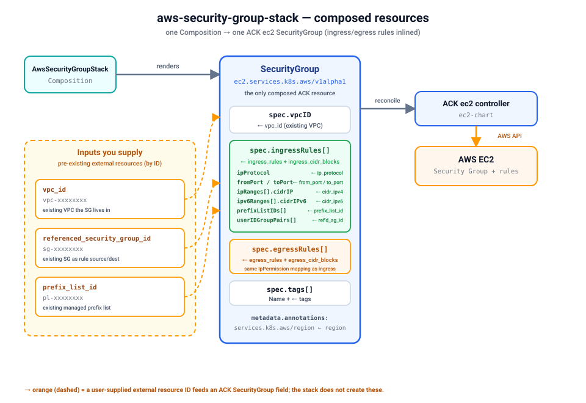

# Quickstart — provision a real Security Group on kind

Install the `aws-security-group-stack` blueprint on a local
[kind](https://kind.sigs.k8s.io/) cluster and provision a **real AWS EC2 Security Group** (with
its ingress/egress rules) end-to-end through Krateo. This stack mirrors the
[`terraform-aws-modules/security-group/aws`](https://registry.terraform.io/modules/terraform-aws-modules/security-group/aws)
module: a `CompositionDefinition` publishes the `AwsSecurityGroupStack` type, you create one
`AwsSecurityGroupStack` Composition, and the chain
`Krateo → ACK SecurityGroup CR → ACK ec2 controller → AWS` materializes the security group and
its rules.



Verified with: kind `v0.24`, Helm `v3.19`, `core-provider 1.0.0`, ACK
`ec2-chart` (e.g. `1.4.6`), `aws-security-group-stack 0.3.0`. Result — the Composition reaches
`Ready=True`, the ACK `SecurityGroup` reaches `ACK.ResourceSynced=True`, and the security group
(with the inlined ingress/egress rules) appears in the EC2 console.

## Prerequisites

- An AWS account and credentials with EC2 security-group permissions
  (`ec2:CreateSecurityGroup`, `Authorize*SecurityGroup*`, `Revoke*`, `DescribeSecurityGroup*`,
  `DeleteSecurityGroup`, `CreateTags`). The simplest setup: a dedicated IAM user (see
  [`../../../docs/authentication.md`](../../../docs/authentication.md) for IRSA and
  least-privilege alternatives). You'll need its access key id + secret.
- `kind`, `kubectl`, `helm`, and the `aws` CLI installed.
- **Pre-existing external resources you must supply as inputs** — this stack composes only the
  `SecurityGroup`; it does **not** create the resources it references. Have their IDs ready for
  any field you use:
  - **`vpc_id`** — ID of an **existing VPC** (e.g. `vpc-0123456789abcdef0`) the security group is
    created in. Leave empty to place it in the region's default VPC.
  - **`referenced_security_group_id`** — ID of an **existing security group** (e.g. `sg-0a1b2c…`)
    used as the source/destination of a rule. Optional, per-rule.
  - **`prefix_list_id`** — ID of an **existing managed prefix list** (e.g. `pl-0a1b2c…`) used in a
    rule. Optional, per-rule.

> This quickstart uses the static-credential path (a Kubernetes Secret) because it works on any
> cluster. On EKS, prefer IRSA / Pod Identity and skip the Secret — see
> [`../../../docs/authentication.md`](../../../docs/authentication.md).

## 1. Create a kind cluster

Skip this if you already have a cluster; just point `kubectl` at it.

```sh
kind create cluster --name ack-e2e --wait 90s
```

## 2. Configure AWS credentials

Store your IAM user's key in a local profile (do this in your own terminal so the secret never
lands in logs):

```sh
aws configure set aws_access_key_id     <ACCESS_KEY_ID>     --profile krateo-ack
aws configure set aws_secret_access_key <SECRET_ACCESS_KEY> --profile krateo-ack
aws configure set region                eu-central-1        --profile krateo-ack
aws --profile krateo-ack sts get-caller-identity     # confirms the user
```

Create the `ack-system` namespace and a Secret holding an AWS shared-credentials file (the ACK
controller chart expects a `credentials` key). The command substitution keeps the secret out of
your shell history:

```sh
kubectl create namespace ack-system

kubectl create secret generic aws-credentials -n ack-system \
  --from-literal=credentials="$(printf '[default]\naws_access_key_id = %s\naws_secret_access_key = %s\n' \
      "$(aws --profile krateo-ack configure get aws_access_key_id)" \
      "$(aws --profile krateo-ack configure get aws_secret_access_key)")"
```

## 3. Install the ACK ec2 controller

This stack renders an ACK **ec2** `SecurityGroup` resource, so it needs the ACK ec2 controller
(see [`../../../docs/installing-controllers.md`](../../../docs/installing-controllers.md)).
Resolve the latest chart version, then install it into `ack-system`:

```sh
export CHART_VERSION=$(
  helm show chart oci://public.ecr.aws/aws-controllers-k8s/ec2-chart 2>/dev/null \
    | awk '/^version:/{print $2}'
)

helm install ack-ec2-controller \
  oci://public.ecr.aws/aws-controllers-k8s/ec2-chart --version "${CHART_VERSION}" \
  --namespace ack-system \
  --set aws.region=eu-central-1 \
  --set aws.credentials.secretName=aws-credentials \
  --set aws.credentials.secretKey=credentials \
  --set aws.credentials.profile=default \
  --wait

kubectl get pods -n ack-system            # ack-ec2-controller ... 1/1 Running
kubectl get crd securitygroups.ec2.services.k8s.aws
```

## 4. Install Krateo core-provider

`core-provider` reconciles `CompositionDefinition`s into CRDs and renders Compositions (it
bundles chart-inspector and deploys the composition-dynamic-controller).

```sh
helm repo add krateo https://charts.krateo.io && helm repo update krateo
helm install core-provider krateo/core-provider --version 1.0.0 \
  -n krateo-system --create-namespace --wait

kubectl get pods -n krateo-system         # core-provider + chart-inspector Running
```

## 5. Register the blueprint

Create the stack namespace and apply the `CompositionDefinition`. It pulls the chart straight
from the public GHCR OCI artifact `oci://ghcr.io/braghettos/charts/aws-security-group-stack:0.3.0`
(no credentials needed):

```sh
kubectl create namespace aws-security-group-system
kubectl apply -f compositiondefinition.yaml   # publishes the AwsSecurityGroupStack type
kubectl apply -f customform.yaml              # optional: Krateo portal card + form

kubectl wait compositiondefinition/aws-security-group-stack -n aws-security-group-system \
  --for=condition=Ready --timeout=300s
```

This publishes an `AwsSecurityGroupStack` Composition type (`composition.krateo.io/v0-3-0`, plural
`awssecuritygroupstacks`) and starts a dedicated `awssecuritygroupstacks-v0-3-0-controller`.

## 6. Create the Composition

The spec uses the **same input names as the Terraform module**. The example below matches
`chart/values.yaml`. Replace the `vpc_id` placeholder with a **real existing VPC ID** (or remove
the line to use the region's default VPC):

```sh
kubectl apply -f - <<'EOF'
apiVersion: composition.krateo.io/v0-3-0
kind: AwsSecurityGroupStack
metadata:
  name: my-web-sg
  namespace: aws-security-group-system
spec:
  region: eu-central-1
  name: krateo-sg
  description: "Example web security group managed by Krateo"
  # ID of an EXISTING VPC — replace with yours; empty/omit = region's default VPC.
  vpc_id: vpc-xxxxxxxxxxxxxxxxx
  ingress_rules:
    - description: "HTTP from anywhere"
      from_port: 80
      to_port: 80
      ip_protocol: tcp
      cidr_ipv4: "0.0.0.0/0"
    - description: "HTTPS from anywhere"
      from_port: 443
      to_port: 443
      ip_protocol: tcp
      cidr_ipv4: "0.0.0.0/0"
  egress_rules:
    - description: "All outbound traffic"
      from_port: -1
      to_port: -1
      ip_protocol: "-1"
      cidr_ipv4: "0.0.0.0/0"
  tags:
    managed-by: krateo
EOF

kubectl wait awssecuritygroupstack/my-web-sg -n aws-security-group-system \
  --for=condition=Ready --timeout=300s
```

> Rules that reference other AWS resources use **existing** IDs: set
> `referenced_security_group_id: sg-xxxxxxxx` (source/destination SG) or
> `prefix_list_id: pl-xxxxxxxx` (managed prefix list) on a rule object. The stack does not create
> them.

## 7. Verify

```sh
# Krateo Composition is Ready, and Krateo applied an ACK SecurityGroup CR:
kubectl get awssecuritygroupstacks -n aws-security-group-system
kubectl get securitygroups.ec2.services.k8s.aws -n aws-security-group-system

# The ACK SecurityGroup reconciled successfully against AWS:
kubectl get securitygroups.ec2.services.k8s.aws -n aws-security-group-system \
  -o jsonpath='{.items[0].status.conditions[?(@.type=="ACK.ResourceSynced")].status}{"\n"}'
# -> True

# Grab the real group id ACK wrote back, then inspect the real SG + rules in AWS:
SG_ID=$(kubectl get securitygroups.ec2.services.k8s.aws -n aws-security-group-system \
  -o jsonpath='{.items[0].status.id}')
echo "$SG_ID"
aws --profile krateo-ack ec2 describe-security-groups --group-ids "$SG_ID"
```

The EC2 console shows the same security group, its inbound rules (HTTP/443 from `0.0.0.0/0`),
outbound rules, and the `managed-by=krateo` + `Name` tags from the Composition spec.

## 8. Clean up

Deleting the Composition cascades through ACK and removes the **real** security group (and its
inlined rules):

```sh
kubectl delete awssecuritygroupstack my-web-sg -n aws-security-group-system
kubectl wait --for=delete securitygroups.ec2.services.k8s.aws \
  -n aws-security-group-system --all --timeout=180s
aws --profile krateo-ack ec2 describe-security-groups --group-ids "$SG_ID"  # -> InvalidGroup.NotFound

kind delete cluster --name ack-e2e
```

## Limitations / required inputs

- **The VPC must already exist.** `vpc_id` is passed straight to the ACK `SecurityGroup` as
  `spec.vpcID`; this stack does not create the VPC. Likewise `referenced_security_group_id` and
  `prefix_list_id` reference **existing** external resources by ID.
- Mirrors the module's **core** inputs, not all of them (e.g. `use_name_prefix`, `timeouts`,
  `vpc_associations`, `enable_exclusive_rules` are not exposed). Full schema in
  [`chart/values.schema.json`](chart/values.schema.json).
- `revoke_rules_on_delete` is accepted for input-name parity with the Terraform module but has no
  effect: the ACK controller removes the security group and its inlined rules together on delete.
- The Terraform module models `ingress_rules`/`egress_rules` as maps; here they are modeled as a
  list of rule objects (each mapped to one ACK `IpPermission`) so the Krateo form can render them.
