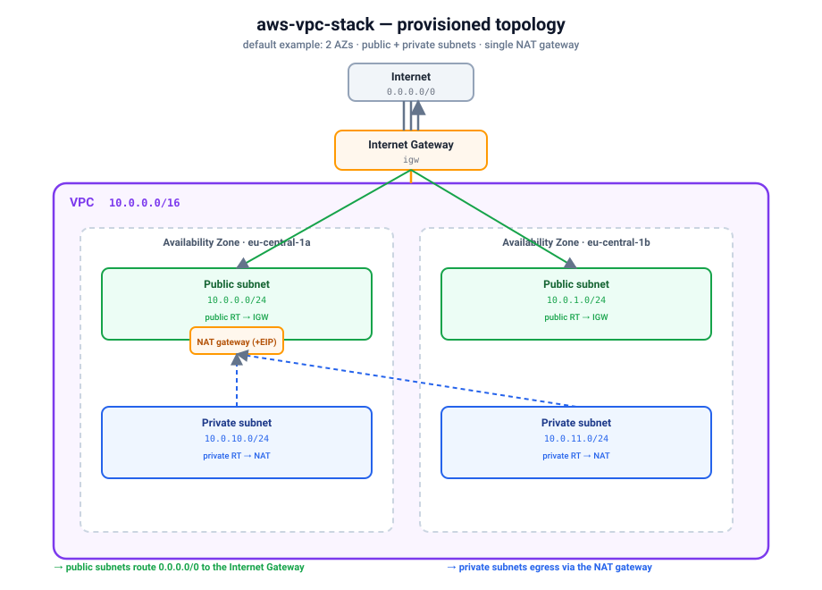

# Quickstart — provision a real AWS VPC on kind

Install the `aws-vpc-stack` **complex blueprint** on a local [kind](https://kind.sigs.k8s.io/)
cluster and provision a **real Amazon VPC** end-to-end through Krateo. One `CompositionDefinition`
publishes the `AwsVpcStack` type, you create a single `AwsVpcStack` Composition, and Krateo renders
it into ~10 wired ACK ec2 resources (VPC, subnets, route tables, Internet Gateway, EIP, NAT
gateway) that the chain `Krateo → ACK ec2 CRs → ACK ec2 controller → AWS` materializes on AWS. The
input names mirror the [`terraform-aws-modules/vpc/aws`](https://registry.terraform.io/modules/terraform-aws-modules/vpc/aws)
Terraform module.



Verified with: kind `v0.24`, Helm `v3.19`, `core-provider 1.0.0`, ACK `ec2-chart` (controller),
`aws-vpc-stack 0.3.0`. Result — the Composition reaches `Ready=True`, each composed ACK resource
reaches `ACK.ResourceSynced=True` in dependency order (**VPC → IGW → public RT → public subnets →
NAT/EIP → private RT → private subnets**), and the VPC + subnets + IGW + NAT appear in the VPC
console with `0.0.0.0/0` routes to the IGW (public) and NAT (private).

## Prerequisites

- An AWS account and credentials with **EC2 VPC permissions** — the ACK ec2 controller's IAM
  principal needs to create/delete VPCs, subnets, route tables, Internet Gateways, Elastic IPs and
  NAT gateways. The simplest setup is a dedicated IAM user with `AmazonVPCFullAccess` (plus EIP
  permissions); see [`../../../docs/authentication.md`](../../../docs/authentication.md) for IRSA
  and least-privilege alternatives. You'll need its access key id + secret.
- `kind`, `kubectl`, `helm`, and the `aws` CLI installed.

> This quickstart uses the static-credential path (a Kubernetes Secret) because it works on any
> cluster. On EKS, prefer IRSA / Pod Identity and skip the Secret.

### Required inputs you must supply

Unlike a single-resource blueprint, this stack **creates the whole network from scratch** — it
does **not** reference any pre-existing AWS resources (no subnet IDs, security-group IDs, or IAM
role ARNs to look up). You only need to choose values that fit your account:

- **`region`** — an AWS region the controller can reach (e.g. `eu-central-1`). Empty inherits the
  controller default.
- **`azs`** — availability zone names **that exist in that region** (e.g. `eu-central-1a`,
  `eu-central-1b`). Public/private subnet CIDRs are paired with `azs` by index.
- **`cidr`** + **`public_subnets`** / **`private_subnets`** — non-overlapping CIDR blocks inside
  the VPC CIDR. Subnet CIDRs must be subsets of `cidr`.

## 1. Create a kind cluster

```sh
kind create cluster --name ack-e2e --wait 90s
```

## 2. Configure AWS credentials

Store your IAM user's key in a local profile (do this in your own terminal so the secret never
lands in logs):

```sh
aws configure set aws_access_key_id     <ACCESS_KEY_ID>     --profile krateo-ack
aws configure set aws_secret_access_key <SECRET_ACCESS_KEY> --profile krateo-ack
aws configure set region                eu-central-1        --profile krateo-ack
aws --profile krateo-ack sts get-caller-identity     # confirms the user
```

Create the `ack-system` namespace and a Secret holding an AWS shared-credentials file (the ACK
controller chart expects a `credentials` key). The command substitution keeps the secret out of
your shell history:

```sh
kubectl create namespace ack-system

kubectl create secret generic aws-credentials -n ack-system \
  --from-literal=credentials="$(printf '[default]\naws_access_key_id = %s\naws_secret_access_key = %s\n' \
      "$(aws --profile krateo-ack configure get aws_access_key_id)" \
      "$(aws --profile krateo-ack configure get aws_secret_access_key)")"
```

## 3. Install the ACK ec2 controller

This stack renders `ec2.services.k8s.aws` resources, so it needs the ACK **ec2** controller
(`oci://public.ecr.aws/aws-controllers-k8s/ec2-chart`). See
[`../../../docs/installing-controllers.md`](../../../docs/installing-controllers.md) for the
general install pattern.

```sh
helm install ack-ec2-controller \
  oci://public.ecr.aws/aws-controllers-k8s/ec2-chart \
  --namespace ack-system \
  --set aws.region=eu-central-1 \
  --set aws.credentials.secretName=aws-credentials \
  --set aws.credentials.secretKey=credentials \
  --set aws.credentials.profile=default \
  --wait

kubectl get pods -n ack-system            # ack-ec2-controller ... 1/1 Running
kubectl get crd vpcs.ec2.services.k8s.aws subnets.ec2.services.k8s.aws \
  routetables.ec2.services.k8s.aws internetgateways.ec2.services.k8s.aws \
  natgateways.ec2.services.k8s.aws elasticipaddresses.ec2.services.k8s.aws
```

> To pin a specific chart version, add `--version <X.Y.Z>`. Resolve the latest with
> `helm show chart oci://public.ecr.aws/aws-controllers-k8s/ec2-chart | awk '/^version:/{print $2}'`.

## 4. Install Krateo core-provider

`core-provider` reconciles `CompositionDefinition`s into CRDs and renders Compositions (it
bundles chart-inspector and deploys the composition-dynamic-controller).

```sh
helm repo add krateo https://charts.krateo.io && helm repo update krateo
helm install core-provider krateo/core-provider --version 1.0.0 \
  -n krateo-system --create-namespace --wait

kubectl get pods -n krateo-system         # core-provider + chart-inspector Running
```

## 5. Register the blueprint

The `CompositionDefinition` pulls the chart straight from the public GHCR OCI artifact
`oci://ghcr.io/braghettos/charts/aws-vpc-stack:0.3.0` (no credentials needed):

```sh
kubectl create namespace aws-vpc-system

kubectl apply -f - <<'EOF'
apiVersion: core.krateo.io/v1alpha1
kind: CompositionDefinition
metadata:
  name: aws-vpc-stack
  namespace: aws-vpc-system
spec:
  chart:
    url: oci://ghcr.io/braghettos/charts/aws-vpc-stack
    version: "0.3.0"
EOF

kubectl wait compositiondefinition/aws-vpc-stack -n aws-vpc-system \
  --for=condition=Ready --timeout=300s
```

This publishes an `AwsVpcStack` Composition type (`composition.krateo.io/v0-3-0`, plural
`awsvpcstacks`) and starts a dedicated `awsvpcstacks-v0-3-0-controller`. The repo also ships a
`compositiondefinition.yaml` and an optional `customform.yaml` (portal card + form) you can apply
instead:

```sh
kubectl apply -f compositiondefinition.yaml   # publishes the AwsVpcStack type
kubectl apply -f customform.yaml              # optional: portal card + form
```

## 6. Create the Composition

The spec below mirrors `chart/values.yaml` — a 2-AZ VPC with a single shared NAT gateway. All
CIDRs are created by the stack, so there are no external IDs to fill in:

```sh
kubectl apply -f - <<'EOF'
apiVersion: composition.krateo.io/v0-3-0
kind: AwsVpcStack
metadata:
  name: my-vpc
  namespace: aws-vpc-system
spec:
  region: eu-central-1
  name: krateo-vpc
  cidr: "10.0.0.0/16"
  azs:
    - eu-central-1a
    - eu-central-1b
  public_subnets:
    - "10.0.0.0/24"
    - "10.0.1.0/24"
  private_subnets:
    - "10.0.10.0/24"
    - "10.0.11.0/24"
  enable_nat_gateway: true
  single_nat_gateway: true
  enable_dns_hostnames: true
  enable_dns_support: true
  map_public_ip_on_launch: true
  instance_tenancy: "default"
  create_igw: true
  tags:
    team: platform
    purpose: ack-e2e
EOF

kubectl wait awsvpcstack/my-vpc -n aws-vpc-system --for=condition=Ready --timeout=600s
```

> NAT gateways take a few minutes to become available, so give the Composition a generous timeout.

## 7. Verify

```sh
# Krateo Composition is Ready, and Krateo rendered the composed ACK ec2 CRs:
kubectl get awsvpcstacks -n aws-vpc-system

# The composed ACK kinds (one Composition fans out into all of these):
kubectl get vpcs.ec2.services.k8s.aws \
  subnets.ec2.services.k8s.aws \
  routetables.ec2.services.k8s.aws \
  internetgateways.ec2.services.k8s.aws \
  natgateways.ec2.services.k8s.aws \
  elasticipaddresses.ec2.services.k8s.aws \
  -n aws-vpc-system

# Every composed resource reconciled successfully against AWS:
kubectl get vpcs.ec2.services.k8s.aws -n aws-vpc-system \
  -o jsonpath='{range .items[*]}{.metadata.name}{"\t"}{.status.conditions[?(@.type=="ACK.ResourceSynced")].status}{"\n"}{end}'
# -> ... True

# The real VPC + subnets exist in AWS:
aws --profile krateo-ack ec2 describe-vpcs \
  --filters Name=tag:Name,Values=krateo-vpc \
  --query 'Vpcs[].VpcId' --output text
```

The VPC console shows the same: one VPC (`10.0.0.0/16`), two public and two private subnets across
the two AZs, an Internet Gateway, a single NAT gateway with an Elastic IP, and route tables with
`0.0.0.0/0` pointing at the IGW (public) and the NAT (private).

## 8. Clean up

Deleting the Composition cascades through ACK and removes the **real** VPC and every resource the
stack created, in reverse dependency order:

```sh
kubectl delete awsvpcstack my-vpc -n aws-vpc-system
kubectl wait --for=delete vpcs.ec2.services.k8s.aws -n aws-vpc-system --all --timeout=300s

kind delete cluster --name ack-e2e
```

## Limitations / required inputs

- The stack mirrors the Terraform module's **core inputs only** (not all 200+); the full input
  schema is in [`chart/values.schema.json`](chart/values.schema.json).
- NAT behavior: `single_nat_gateway: true` provisions one shared NAT; set it `false` (with
  `enable_nat_gateway: true`) for one NAT per public subnet/AZ.
- Required inputs are limited to network parameters you choose (`region`, `azs`, `cidr`,
  `public_subnets`, `private_subnets`). The stack **creates everything itself** — it does not
  consume pre-existing subnet IDs, security-group IDs, or IAM role ARNs.
- `azs` must name zones that exist in `region`, and subnet CIDRs must be non-overlapping subsets of
  `cidr`, or the ACK resources will fail to reconcile.
```
