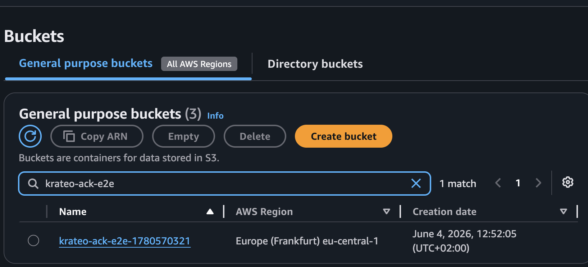
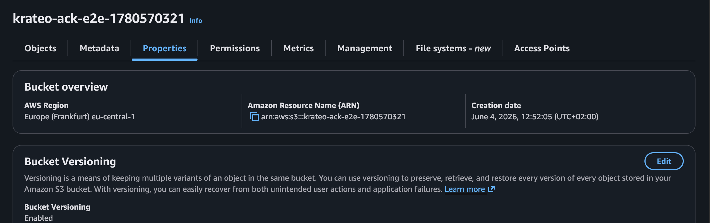
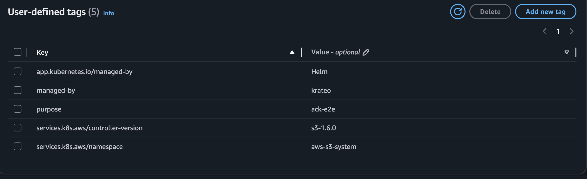

# Quickstart — provision a real S3 bucket on kind

Install the `aws-s3-bucket` blueprint on a local [kind](https://kind.sigs.k8s.io/) cluster and
provision a **real Amazon S3 bucket** end-to-end through Krateo: a `CompositionDefinition`
publishes the `AwsS3Bucket` type, you create one `AwsS3Bucket` Composition, and the chain
`Krateo → ACK Bucket CR → ACK S3 controller → AWS` materializes the bucket.

Verified with: kind `v0.24`, Helm `v3.19`, `core-provider 1.0.0`, ACK `s3-controller 1.6.0`,
`aws-s3-bucket 0.1.1`. Result — the Composition reaches `Ready=True`, the ACK `Bucket` reaches
`ACK.ResourceSynced=True`, and the bucket appears in the S3 console — region `eu-central-1`, with
the versioning and tags set on the Composition spec:



## Prerequisites

- An AWS account and credentials with S3 permissions. The simplest setup: a dedicated IAM user
  with `AmazonS3FullAccess` (see [`../../../docs/authentication.md`](../../../docs/authentication.md)
  for IRSA and least-privilege alternatives). You'll need its access key id + secret.
- `kind`, `kubectl`, `helm`, and the `aws` CLI installed.

> This quickstart uses the static-credential path (a Kubernetes Secret) because it works on any
> cluster. On EKS, prefer IRSA / Pod Identity and skip the Secret.

## 1. Create a kind cluster

```sh
kind create cluster --name ack-e2e --wait 90s
```

## 2. Configure AWS credentials

Store your IAM user's key in a local profile (do this in your own terminal so the secret never
lands in logs):

```sh
aws configure set aws_access_key_id     <ACCESS_KEY_ID>     --profile krateo-ack
aws configure set aws_secret_access_key <SECRET_ACCESS_KEY> --profile krateo-ack
aws configure set region                eu-central-1        --profile krateo-ack
aws --profile krateo-ack sts get-caller-identity     # confirms the user
```

Create the `ack-system` namespace and a Secret holding an AWS shared-credentials file (the ACK
controller chart expects a `credentials` key). The command substitution keeps the secret out of
your shell history:

```sh
kubectl create namespace ack-system

kubectl create secret generic aws-credentials -n ack-system \
  --from-literal=credentials="$(printf '[default]\naws_access_key_id = %s\naws_secret_access_key = %s\n' \
      "$(aws --profile krateo-ack configure get aws_access_key_id)" \
      "$(aws --profile krateo-ack configure get aws_secret_access_key)")"
```

## 3. Install the ACK S3 controller

```sh
helm install ack-s3-controller \
  oci://public.ecr.aws/aws-controllers-k8s/s3-chart --version 1.6.0 \
  --namespace ack-system \
  --set aws.region=eu-central-1 \
  --set aws.credentials.secretName=aws-credentials \
  --set aws.credentials.secretKey=credentials \
  --set aws.credentials.profile=default \
  --wait

kubectl get pods -n ack-system            # ack-s3-controller ... 1/1 Running
kubectl get crd buckets.s3.services.k8s.aws
```

## 4. Install Krateo core-provider

`core-provider` reconciles `CompositionDefinition`s into CRDs and renders Compositions (it
bundles chart-inspector and deploys the composition-dynamic-controller).

```sh
helm repo add krateo https://charts.krateo.io && helm repo update krateo
helm install core-provider krateo/core-provider --version 1.0.0 \
  -n krateo-system --create-namespace --wait

kubectl get pods -n krateo-system         # core-provider + chart-inspector Running
```

## 5. Register the blueprint

The `CompositionDefinition` pulls the chart straight from the public GHCR OCI artifact
`oci://ghcr.io/braghettos/charts/aws-s3-bucket:0.1.1` (no credentials needed):

```sh
kubectl create namespace aws-s3-system

kubectl apply -f - <<'EOF'
apiVersion: core.krateo.io/v1alpha1
kind: CompositionDefinition
metadata:
  name: aws-s3-bucket
  namespace: aws-s3-system
spec:
  chart:
    url: oci://ghcr.io/braghettos/charts/aws-s3-bucket
    version: "0.1.1"
EOF

kubectl wait compositiondefinition/aws-s3-bucket -n aws-s3-system \
  --for=condition=Ready --timeout=300s
```

This publishes an `AwsS3Bucket` Composition type (`composition.krateo.io/v0-1-1`, plural
`awss3buckets`) and starts a dedicated `awss3buckets-v0-1-1-controller`.

## 6. Create the Composition

Bucket names are globally unique, so make one with a suffix:

```sh
BUCKET="krateo-ack-$(date +%s)"

kubectl apply -f - <<EOF
apiVersion: composition.krateo.io/v0-1-1
kind: AwsS3Bucket
metadata:
  name: my-bucket
  namespace: aws-s3-system
spec:
  name: $BUCKET
  region: eu-central-1
  versioning:
    status: Enabled
  tagging:
    tagSet:
      - key: managed-by
        value: krateo
      - key: purpose
        value: ack-e2e
EOF

kubectl wait awss3bucket/my-bucket -n aws-s3-system --for=condition=Ready --timeout=300s
```

## 7. Verify

```sh
# Krateo Composition is Ready, and Krateo applied an ACK Bucket CR:
kubectl get awss3bucket -n aws-s3-system
kubectl get bucket.s3.services.k8s.aws -n aws-s3-system

# The ACK Bucket reconciled successfully against AWS:
kubectl get bucket.s3.services.k8s.aws -n aws-s3-system \
  -o jsonpath='{.items[0].status.conditions[?(@.type=="ACK.ResourceSynced")].status}{"\n"}'
# -> True

# The real bucket exists in AWS, with the spec's versioning + tags:
aws --profile krateo-ack s3api head-bucket        --bucket "$BUCKET"
aws --profile krateo-ack s3api get-bucket-versioning --bucket "$BUCKET"   # Status: Enabled
aws --profile krateo-ack s3api get-bucket-tagging    --bucket "$BUCKET"
```

The S3 console shows the same. The bucket's **Properties** report the region, ARN, and **Bucket
Versioning: Enabled** (from `spec.versioning.status`):



…and its **Tags** include the `tagSet` from the Composition (`managed-by=krateo`, `purpose=ack-e2e`)
alongside the tags ACK adds automatically:



## 8. Clean up

Deleting the Composition cascades through ACK and removes the **real** bucket (S3 requires the
bucket be empty first):

```sh
kubectl delete awss3bucket my-bucket -n aws-s3-system
kubectl wait --for=delete bucket.s3.services.k8s.aws -n aws-s3-system --all --timeout=180s
aws --profile krateo-ack s3api head-bucket --bucket "$BUCKET"   # -> 404 Not Found

kind delete cluster --name ack-e2e
```
